# Model Report — Customer Churn Prediction & Explainable ML

Generated by `python -m src.run report` from `reports/run_results.json`. Every number is produced by the pipeline; none is typed by hand.

## Headline

- Best model by cross-validated PR-AUC: **xgboost** (PR-AUC 0.6753).
- It beats an **untuned logistic regression** by only +0.0063 PR-AUC (0.23 pooled SD), paired t-test p=0.469 — **not significant**. On this dataset gradient boosting does not earn its complexity on discrimination alone.
- The designated test split is the **weakest of 5 folds** (PR-AUC 0.6134 vs across-fold mean 0.6609, sd 0.0318). The split was **not re-drawn** to improve the number.
- Calibration selected: **none** — the model was already well calibrated, so a calibrator was only adopted if it cleared a pre-declared Brier gain of 0.001.
- Value-optimal threshold **0.13**, not 0.5, because a missed churner costs far more than a wasted contact under the assumed economics.
- A **per-customer expected-value rule** returns 63,799 CU from 713 contacts, against 63,446 CU for the best single global threshold.

> **All currency figures are conditional on assumptions.** The dataset contains no campaign costs, offer values or intervention outcomes, so the retention economics in `configs/config.yaml` are declared inputs, not measurements. Figures use neutral **currency units (CU)**. They are not a claim about a real business.

## 1. Data and target

- Rows: **7,043**; churn rate **26.54%** (~1:2.77 imbalance).
- Target: `Churn == 'Yes'`.
- Missing (including whitespace-only cells): `{'TotalCharges': 11}`. `TotalCharges` is published as text; its 11 blanks all have `tenure == 0`, so the value is structurally absent, not missing at random, and is set to 0.
- Duplicates: 0 exact, 0 duplicate ids, 40 feature-identical.
- **42 rows in 18 groups are feature-identical with contradictory labels** — irreducible label noise (0.60% of rows).
- Train/test contamination after group-aware splitting: **0**.
- Invalid ranges: `none`; unexpected categories: `none`; structural inconsistencies: `none`.

Full detail in [data_audit.md](./data_audit.md).

### Leakage audit

Each feature scored alone under 5-fold stratified CV. A feature approaching AUC 1.0 would be the target in disguise.

| feature | cv_roc_auc_alone |
|---|---|
| Contract | 0.7391 |
| tenure | 0.7319 |
| OnlineSecurity | 0.7055 |
| TechSupport | 0.7035 |
| InternetService | 0.6953 |
| OnlineBackup | 0.6777 |

**Leakage suspects: none.** The strongest single feature is a genuine commercial predictor, not an outcome.

`TotalCharges` regressed on `tenure x MonthlyCharges` gives **R² = 0.9991** — redundancy, not leakage. The engineered `billing_discrepancy` uses the residual instead of restating it.

**Limitation:** the dataset is one snapshot with no event timestamps, so no out-of-time split and no empirical post-churn test are possible. Post-churn risk is assessed per column from semantics.

## 2. EDA findings

- Overall churn (train): **26.45%**.
- Churn is heavily front-loaded: **53.3%** in the first 6 months against **9.2%** at 49–72 months.
- Month-to-month + 0–6 months is both the highest-risk and highest-volume cell: **55.9%** churn across **1,094** customers.
- Electronic check churns at **45.5%**; fibre at **41.9%**.
- Median monthly charge: **79.85** for churners vs **64.65** for stayers.
- Add-on adoption is monotonically protective: churn falls from **50.2%** at 0 add-ons to **4.9%** at 6.

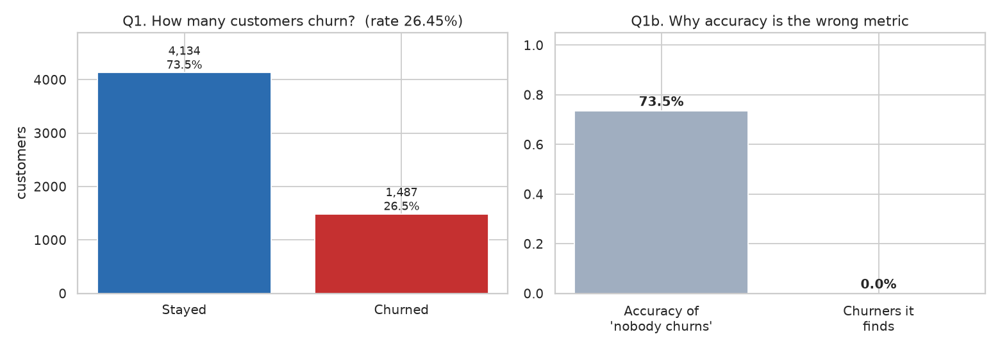
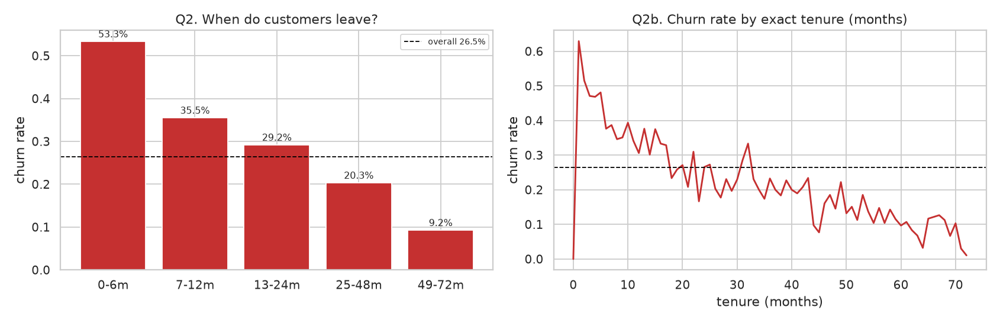
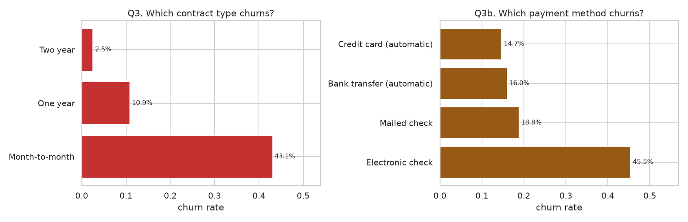
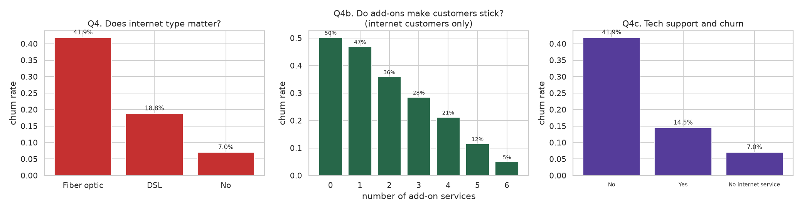
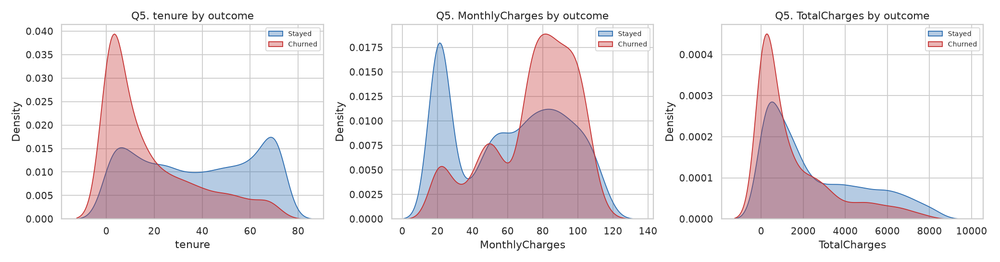
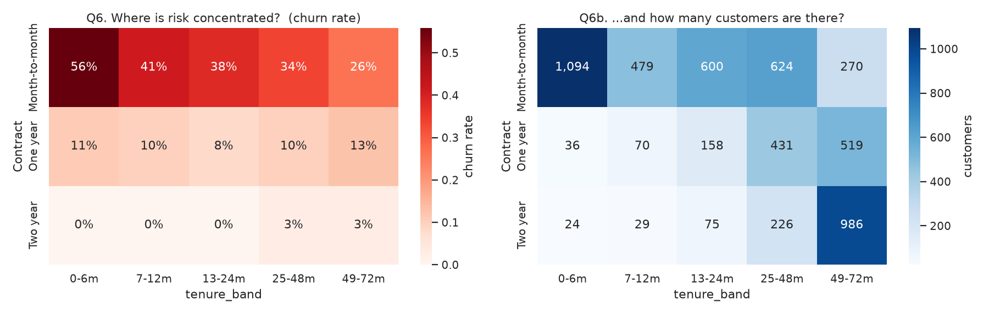

## 3. Engineered features

All features are **row-wise**, so they depend only on the customer's own values. That is what makes them safe to compute before the split and identical at inference. No target encoding or dataset-level aggregate is used.

| feature | type | why it should help |
|---|---|---|
| `tenure_band` | categorical | Churn is heavily front-loaded: 53.3% in the first 6 months against 9.2% at 49-72 months. Banding gives the linear model the step change it cannot express from raw tenure, and makes the risk legible to a retention team. |
| `is_new_customer` | binary | Isolates the 0-6 month window, the single riskiest period. Retention playbooks for new customers (onboarding) differ from those for established ones. |
| `n_addons` | numeric | Count of the six internet add-ons held. Churn falls monotonically with it: 50.2% at zero add-ons to 4.9% at six. This is the clearest stickiness signal in the data — each additional service is another switching cost. |
| `has_internet` | binary | Separates 'declined an add-on' from 'cannot have one'. The add-on columns use a structural 'No internet service' category, so without this flag n_addons=0 conflates two different customers. |
| `addon_adoption_rate` | numeric | n_addons as a share of those available to that customer (0 when no internet). Normalises adoption so internet and non-internet customers are comparable. |
| `is_month_to_month` | binary | Contract is the strongest single predictor (AUC 0.739 alone); month-to-month churns at 43.1% versus 2.5% on two-year terms. An explicit flag lets the linear model use it directly and makes the SHAP output readable. |
| `is_autopay` | binary | Electronic check churns at 45.5%, far above the automatic methods. An automatic payment instruction is both a friction reducer and a commitment signal. |
| `realized_arpu` | numeric | TotalCharges / tenure: what the customer has actually averaged per month, as opposed to their current list price. Captures the effect of past discounts. |
| `price_vs_history` | numeric | MonthlyCharges / realized_arpu. Above 1 means the customer now pays more than their historical average — a recent price rise or expiring promotion, which is a recognised churn trigger. This is the feature a raw price level cannot express. |
| `billing_discrepancy` | numeric | TotalCharges - (tenure x MonthlyCharges). The audit found TotalCharges is 99.91% explained by that product, so the residual is the only genuinely new information in the column. Using the residual instead of the raw value avoids feeding the model a third copy of the same signal. |
| `charges_per_addon` | numeric | MonthlyCharges / (n_addons + 1): price paid per unit of service received. A value-for-money proxy — high spend with few services is a plausible grievance. |
| `household_size` | numeric | Partner + Dependents (0-2). A household account is harder to move than a single line, so it proxies switching cost. |
| `tenure_x_month_to_month` | numeric | Interaction between tenure and the month-to-month flag. Included because the tenure effect is contract-dependent (the heatmap shows month-to-month churn falling 56%->26% across tenure while two-year stays near 0%). Trees can discover this; the linear model cannot without being given it. |

## 4. Model comparison

Cross-validated on the training split with group-aware `StratifiedGroupKFold` (k=5), tuned on `average_precision`.

| model | tuned | pr_auc | pr_auc_std | roc_auc | f1 | recall | precision | brier |
|---|---|---|---|---|---|---|---|---|
| xgboost | True | 0.6753 | 0.0252 | 0.8512 | 0.5877 | 0.5238 | 0.6709 | 0.1326 |
| random_forest | True | 0.6722 | 0.0240 | 0.8510 | 0.5774 | 0.5030 | 0.6788 | 0.1330 |
| logistic_regression | True | 0.6704 | 0.0300 | 0.8524 | 0.5978 | 0.5393 | 0.6712 | 0.1324 |
| logistic_regression_plain | False | 0.6690 | 0.0301 | 0.8519 | 0.5990 | 0.5413 | 0.6710 | 0.1325 |
| dummy_prior | False | 0.2645 | 0.0004 | 0.5000 | 0.0000 | 0.0000 | 0.0000 | 0.1946 |

Best hyperparameters (`xgboost`): `{'subsample': 1.0, 'reg_lambda': 0.5, 'n_estimators': 300, 'min_child_weight': 1, 'max_depth': 4, 'learning_rate': 0.02, 'colsample_bytree': 0.6}`

### Does the complex model earn its place?

Paired across identical folds: **xgboost** 0.6753 vs **logistic_regression_plain** 0.6690, difference +0.0063 (0.23 pooled SD). Paired t p=0.4690, Wilcoxon p=0.6250 → **significant: False**.

With five folds the test has low power, so this means *the data cannot distinguish them*, not that they are proven equal. The honest reading: logistic regression is a legitimate production choice here, trains in ~2s against ~16s, and is inherently interpretable. The boosted model is retained mainly because `TreeExplainer` gives exact SHAP values.

### Split stability

Each fold used in turn as the held-out test set, to show how much of a single split's score is luck.

| fold | is_designated_test | n | churn_rate | pr_auc | roc_auc | brier |
|---|---|---|---|---|---|---|
| 0 | True | 1406 | 0.2646 | 0.6134 | 0.8270 | 0.1425 |
| 1 | False | 1405 | 0.2648 | 0.6868 | 0.8589 | 0.1285 |
| 2 | False | 1406 | 0.2646 | 0.6436 | 0.8471 | 0.1368 |
| 3 | False | 1406 | 0.2646 | 0.6855 | 0.8552 | 0.1309 |
| 4 | False | 1404 | 0.2642 | 0.6752 | 0.8534 | 0.1310 |

Spread across folds is **0.0734** PR-AUC. Fold 0 is the designated test set and the weakest of the 5; it was not re-drawn. Treat **0.6609 ± 0.0318** as the more reliable estimate and the single-split figure as conservative.

## 5. Probability calibration

Retention decisions multiply probability by customer value, so the probabilities must mean what they say. A model that ranks well but is miscalibrated by 2x inflates every expected-value calculation and spends real budget against an imagined return.

| method | brier | ece | log_loss | pr_auc |
|---|---|---|---|---|
| none | 0.1425 | 0.0257 | 0.4379 | 0.6134 |
| sigmoid | 0.1437 | 0.0461 | 0.4428 | 0.6178 |
| isotonic | 0.1421 | 0.0260 | 0.4384 | 0.6185 |

Selected: **none**. Calibrators are fitted with internal CV on the training split only and judged on the untouched test set.

`ece` is reported next to Brier because the Brier score mixes calibration and discrimination, so it can improve for the wrong reason.

## 6. Evaluation and threshold selection

### Why accuracy is not the headline

Predicting 'nobody churns' scores **73.46% accuracy** and finds zero churners. Accuracy also presumes a 0.5 cutoff, which no retention campaign would choose.

| threshold | roc_auc | pr_auc | precision | recall | f1 | accuracy | brier | log_loss | tn | fp | fn | tp |
|---|---|---|---|---|---|---|---|---|---|---|---|---|
| 0.5000 | 0.8270 | 0.6134 | 0.6308 | 0.4731 | 0.5407 | 0.7873 | 0.1425 | 0.4379 | 931 | 103 | 196 | 176 |
| 0.1300 | 0.8270 | 0.6134 | 0.4186 | 0.9059 | 0.5726 | 0.6422 | 0.1425 | 0.4379 | 566 | 468 | 35 | 337 |

### Cost/value framework

```
EV(contact) = p x success_rate x value - (contact_cost + incentive_cost)

contact_cost   = 5.0 CU      (assumed)
incentive_cost = 30.0 CU     (assumed)
success_rate   = 0.3        (assumed)
value          = MonthlyCharges x 12 months
```

| policy | net value (CU) | contacts |
|---|---:|---:|
| contact nobody | 0 | 0 |
| contact everyone | 49,916 | all |
| best global threshold (0.13) | 63,446 | — |
| **per-customer EV rule** | **63,799** | 713 |

The per-customer rule wins because the break-even probability varies with customer value, from **8.2%** to **51.9%** across the test set. A single global cut cannot express that a high-value customer is worth contacting at much lower risk than a low-value one.

### Sensitivity to the assumptions

The optimal threshold is a function of parameters the data cannot supply, so a single threshold presented as *the* answer would hide that dependency.

| success_rate | incentive_cost | best_threshold | net_value | contact_rate | precision | recall |
|---|---|---|---|---|---|---|
| 0.100 | 10.000 | 0.180 | 18726.600 | 0.496 | 0.456 | 0.855 |
| 0.100 | 30.000 | 0.390 | 8383.120 | 0.284 | 0.598 | 0.642 |
| 0.100 | 60.000 | 0.750 | 1148.940 | 0.051 | 0.819 | 0.159 |
| 0.200 | 10.000 | 0.050 | 49398.240 | 0.719 | 0.357 | 0.970 |
| 0.200 | 30.000 | 0.180 | 33968.200 | 0.496 | 0.456 | 0.855 |
| 0.200 | 60.000 | 0.390 | 18766.240 | 0.284 | 0.598 | 0.642 |
| 0.300 | 10.000 | 0.030 | 81711.120 | 0.773 | 0.335 | 0.978 |
| 0.300 | 30.000 | 0.130 | 63445.540 | 0.573 | 0.419 | 0.906 |
| 0.300 | 60.000 | 0.230 | 43019.320 | 0.434 | 0.490 | 0.804 |
| 0.400 | 10.000 | 0.030 | 114383.160 | 0.773 | 0.335 | 0.978 |
| 0.400 | 30.000 | 0.100 | 94240.880 | 0.624 | 0.396 | 0.935 |
| 0.400 | 60.000 | 0.180 | 71421.400 | 0.496 | 0.456 | 0.855 |
| 0.500 | 10.000 | 0.030 | 147055.200 | 0.773 | 0.335 | 0.978 |
| 0.500 | 30.000 | 0.050 | 126023.100 | 0.719 | 0.357 | 0.970 |
| 0.500 | 60.000 | 0.170 | 100608.000 | 0.508 | 0.450 | 0.863 |

## 7. Risk segmentation

Bands are **validated**, not merely declared: realised churn on the test set is reported beside predicted risk.

| risk_segment | customers | share_of_customers | avg_predicted_risk | realised_churn_rate | share_of_churners | avg_customer_value | recommended_action |
|---|---|---|---|---|---|---|---|
| Low Risk | 528 | 0.3755 | 0.0338 | 0.0455 | 0.0645 | 630.6341 | Normal engagement. No retention spend; include in standard lifecycle comms and monitor for band changes. |
| Medium Risk | 428 | 0.3044 | 0.2062 | 0.2173 | 0.2500 | 806.0790 | Low-cost nurture. Service review, add-on education, or a bundle recommendation. Automated channels only. |
| High Risk | 308 | 0.2191 | 0.4927 | 0.5032 | 0.4167 | 879.4130 | Proactive outreach. Targeted offer or contract-term incentive, prioritised by customer value. |
| Critical Risk | 142 | 0.1010 | 0.7612 | 0.7042 | 0.2688 | 977.7718 | Priority intervention. Human contact with retention authority, subject to the customer clearing the expected-value test. |

- Realised churn rises monotonically across bands: **True**.
- Largest gap between mean predicted risk and realised churn: **0.0569**.
- Top band churns **15.5x** the bottom band.

## 8. Business decision framework

Risk alone is not a decision. The rule combines risk band with customer value and gates every action on an expected-value test.

| risk_segment | value_tier | customers | avg_risk | avg_value_cu | contacts | expected_value_cu | priority |
|---|---|---|---|---|---|---|---|
| Critical Risk | High value | 55 | 0.76 | 1152.10 | 55 | 12555.37 | 1 |
| High Risk | High value | 116 | 0.50 | 1163.65 | 116 | 16007.01 | 2 |
| Critical Risk | Standard value | 87 | 0.76 | 867.57 | 87 | 14178.49 | 3 |
| High Risk | Standard value | 192 | 0.49 | 707.69 | 178 | 13656.14 | 4 |
| Medium Risk | High value | 151 | 0.22 | 1212.10 | 149 | 6582.09 | 5 |
| Medium Risk | Standard value | 277 | 0.20 | 584.75 | 122 | 2364.47 | 6 |
| Low Risk | High value | 102 | 0.05 | 1215.86 | 6 | 14.64 | 7 |
| Low Risk | Standard value | 426 | 0.03 | 490.51 | 0 | 0.00 | 8 |

Contacts recommended: **713** of 1406 test customers. In **277** cases the expected-value test recommends contact for a customer in a Low/Medium band — the value dimension overriding the risk band, which a one-dimensional 'contact high risk' rule cannot do.

| risk band | value tier | action | priority |
|---|---|---|---:|
| Critical Risk | High value | Priority retention call from a senior agent with discretionary discount authority and a contract-term offer. | 1 |
| High Risk | High value | Proactive outreach within 7 days: service review plus incentive to move off month-to-month. | 2 |
| Critical Risk | Standard value | Automated retention offer: fixed discount or free add-on for a term commitment. No agent time. | 3 |
| High Risk | Standard value | Targeted automated offer, cheapest effective incentive. | 4 |
| Medium Risk | High value | Relationship nurture: account review, add-on bundle recommendation to raise switching cost. | 5 |
| Medium Risk | Standard value | Monitor. Low-cost engagement content only; re-score next cycle. | 6 |
| Low Risk | High value | Normal engagement. Protect the relationship, no retention spend. Consider upsell instead. | 7 |
| Low Risk | Standard value | Normal engagement. No action. | 8 |

## 9. Explainable ML (SHAP)

Importance aggregated back to business features, because one-hot encoding splits one concept across several columns and understates it.

| base_feature | mean_abs_shap |
|---|---|
| is_month_to_month | 0.4794 |
| tenure | 0.4171 |
| Contract | 0.4126 |
| OnlineSecurity | 0.2356 |
| InternetService | 0.2017 |
| TechSupport | 0.1954 |
| PaymentMethod | 0.1848 |
| MonthlyCharges | 0.1474 |
| realized_arpu | 0.1468 |
| PaperlessBilling | 0.1185 |
| TotalCharges | 0.1147 |
| MultipleLines | 0.0941 |

Aggregated further to business **concepts**, using the same grouping as the per-customer explanations so the global and local views agree. `Contract` and `is_month_to_month` are one commercial fact, not two drivers.

| concept | mean_abs_shap |
|---|---|
| contract | 0.8920 |
| tenure | 0.4438 |
| spend | 0.4352 |
| OnlineSecurity | 0.2356 |
| internet | 0.2074 |
| TechSupport | 0.1954 |
| payment | 0.1921 |
| billing_channel | 0.1185 |
| phone | 0.1082 |
| price_change | 0.1027 |

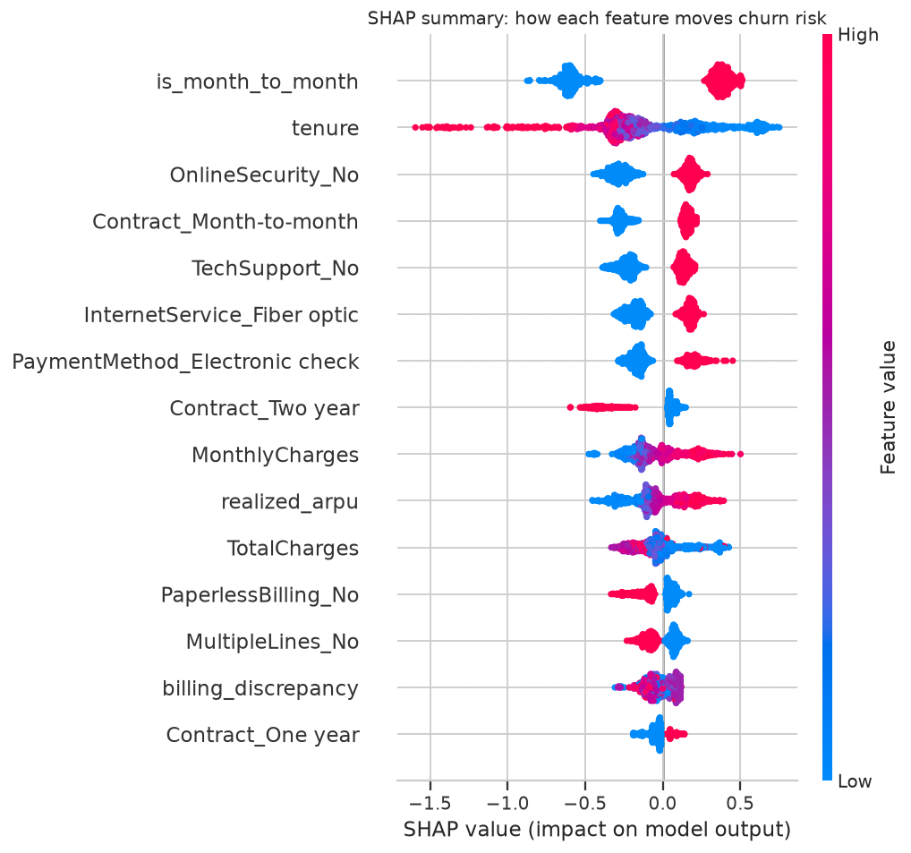
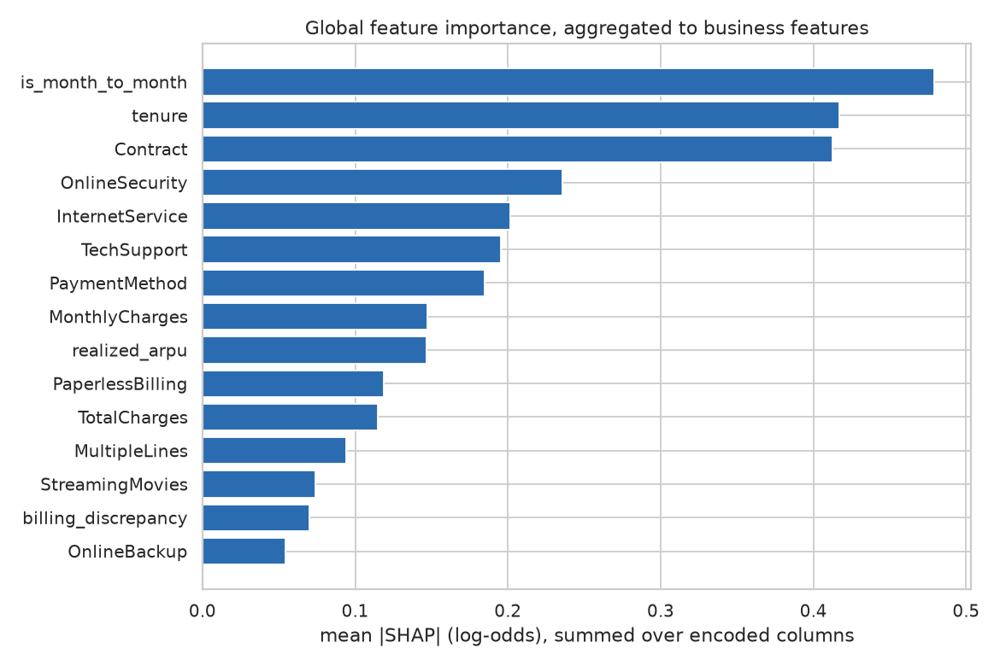

### Representative customers

Contributions are in **log-odds** and are not additive in probability; they rank *why* a customer scored as they did.

**Low Risk** — predicted churn **2.2%** (One year, tenure 53m, 20.20/month)

Increases risk:

- pays in line with their billing history (+0.115)

Reduces risk:

- has no internet service (-0.814)
- is on a one year contract (-0.677)
- pays 20.20 per month (-0.596)
- has been a customer for 53 months (-0.361)

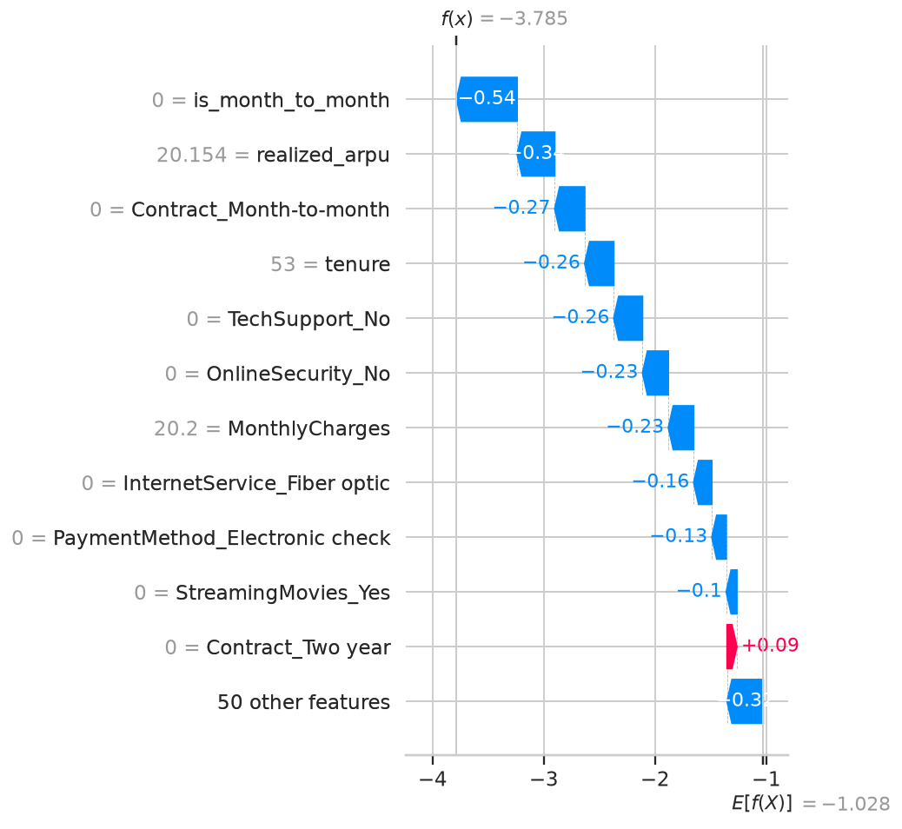

**Medium Risk** — predicted churn **20.2%** (Month-to-month, tenure 3m, 19.95/month)

Increases risk:

- is on a month-to-month contract (+0.626)
- has been a customer for 3 months (+0.452)
- now pays 1.03x their historical average (a recent increase) (+0.133)

Reduces risk:

- has no internet service (-0.983)
- pays 19.95 per month (-0.177)
- receives paper bills (-0.165)
- pays by mailed check (-0.135)

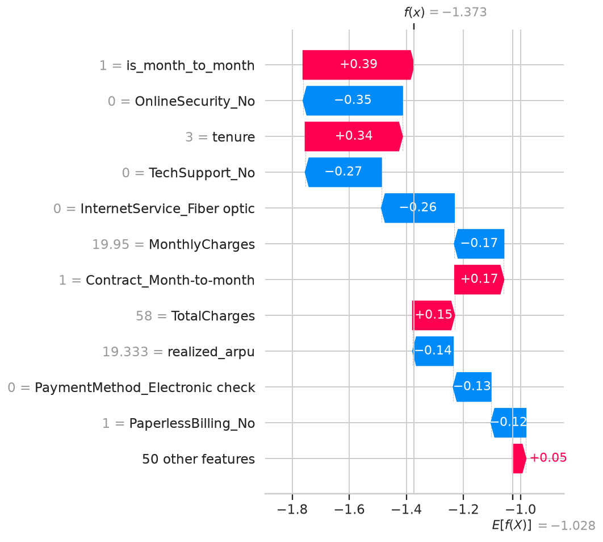

**High Risk** — predicted churn **48.3%** (Month-to-month, tenure 3m, 25.25/month)

Increases risk:

- is on a month-to-month contract (+0.625)
- has been a customer for 3 months (+0.367)
- pays by electronic check (+0.218)
- has no online-security add-on (+0.217)

Reduces risk:

- receives paper bills (-0.377)
- has DSL internet (-0.216)
- pays 25.25 per month (-0.113)
- has no movie-streaming add-on (-0.073)

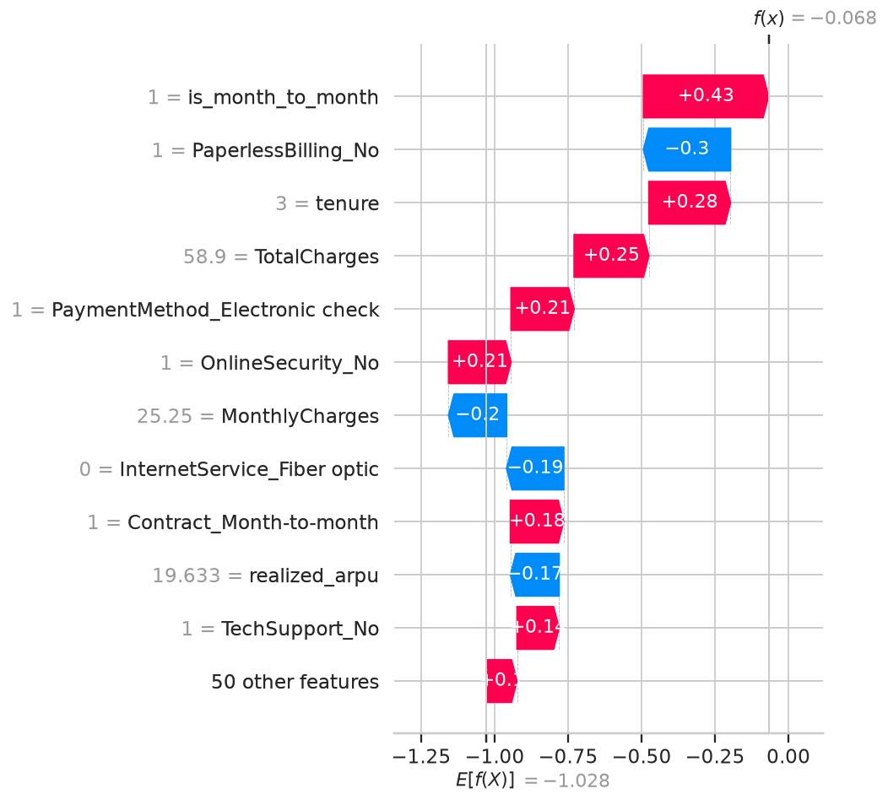

**Critical Risk** — predicted churn **77.3%** (Month-to-month, tenure 7m, 95.60/month)

Increases risk:

- is on a month-to-month contract (+0.575)
- pays 95.60 per month (+0.399)
- has been a customer for 7 months (+0.269)
- has Fiber optic internet (+0.238)

Reduces risk:

- pays by bank transfer (automatic) (-0.136)

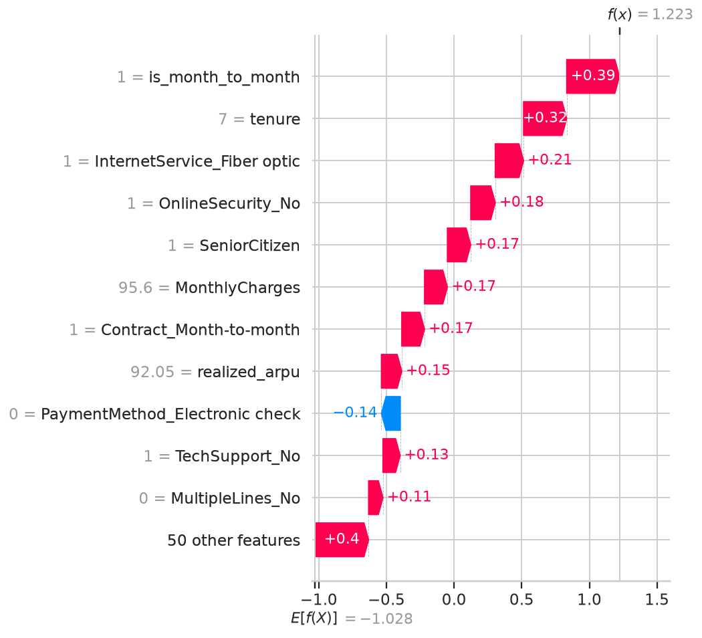

## 10. Error analysis

Mean feature values by outcome class at the operating threshold.

| feature | true_positive | false_negative | false_positive | true_negative |
|---|---|---|---|---|
| tenure | 16.19 | 44.17 | 25.18 | 48.08 |
| MonthlyCharges | 75.52 | 59.57 | 70.45 | 53.24 |
| TotalCharges | 1460.38 | 3116.47 | 2143.42 | 2894.65 |
| predicted probability | 0.52 | 0.07 | 0.35 | 0.04 |

- False negatives: **35**, ~214 CU each in forgone saving.
- False positives: **468**, 35 CU each in wasted spend.
- Cost ratio **6.1:1** (FN:FP).

Under the declared assumptions a missed churner costs about 214 CU in forgone saving, against 35 CU for a wasted contact -- a ratio of 6.1:1. That asymmetry is why the value-optimal threshold is 0.13 rather than 0.5: buying recall with precision is correct while a false negative costs 6x a false positive. The ranking of thresholds is only as sound as the assumed success rate, so the sensitivity table should be read alongside this.

Observed error rate **0.3578** against an irreducible floor of ~**0.0030** from label conflicts. Most error is therefore genuine model limitation, not data noise — but the floor is not zero.

## 11. Segment-level performance and fairness

| attribute | segment | n | churn_rate | roc_auc | pr_auc | recall | precision | calibration_gap |
|---|---|---|---|---|---|---|---|---|
| Contract | Month-to-month | 792 | 0.4091 | 0.7412 | 0.6461 | 0.9691 | 0.4410 | 0.0062 |
| Contract | Two year | 355 | 0.0394 | 0.6994 | 0.1082 | 0.1429 | 0.1429 | -0.0091 |
| Contract | One year | 259 | 0.1313 | 0.7137 | 0.2729 | 0.6176 | 0.2658 | -0.0300 |
| tenure_band | 49-72m | 464 | 0.1056 | 0.7706 | 0.3403 | 0.6122 | 0.2542 | -0.0164 |
| tenure_band | 25-48m | 313 | 0.2077 | 0.7783 | 0.4467 | 0.8923 | 0.3204 | 0.0171 |
| tenure_band | 0-6m | 311 | 0.5113 | 0.7539 | 0.7257 | 0.9937 | 0.5320 | 0.0047 |
| tenure_band | 13-24m | 191 | 0.2670 | 0.7578 | 0.4682 | 0.8824 | 0.3719 | 0.0055 |
| tenure_band | 7-12m | 127 | 0.3780 | 0.7938 | 0.6595 | 0.9583 | 0.5227 | -0.0500 |
| InternetService | Fiber optic | 617 | 0.4149 | 0.7778 | 0.6815 | 0.9648 | 0.4940 | -0.0072 |
| InternetService | DSL | 469 | 0.1919 | 0.7798 | 0.4214 | 0.8333 | 0.3165 | -0.0024 |
| InternetService | No | 320 | 0.0813 | 0.7826 | 0.2583 | 0.5769 | 0.2206 | -0.0014 |
| PaymentMethod | Electronic check | 435 | 0.4391 | 0.7478 | 0.6758 | 0.9581 | 0.4816 | 0.0264 |
| PaymentMethod | Bank transfer (automatic) | 330 | 0.1939 | 0.7934 | 0.5518 | 0.7656 | 0.3311 | -0.0281 |
| PaymentMethod | Credit card (automatic) | 325 | 0.1723 | 0.8414 | 0.4878 | 0.8571 | 0.3902 | -0.0242 |
| PaymentMethod | Mailed check | 316 | 0.1930 | 0.8656 | 0.5764 | 0.9344 | 0.3701 | -0.0012 |
| SeniorCitizen | 0 | 1180 | 0.2373 | 0.8278 | 0.5725 | 0.8893 | 0.4003 | -0.0031 |
| SeniorCitizen | 1 | 226 | 0.4071 | 0.7907 | 0.7199 | 0.9565 | 0.4809 | -0.0105 |
| gender | Female | 705 | 0.2539 | 0.8283 | 0.6008 | 0.9274 | 0.3981 | 0.0143 |
| gender | Male | 701 | 0.2753 | 0.8277 | 0.6337 | 0.8860 | 0.4407 | -0.0230 |

Largest performance spreads within an attribute:

| measure | spread |
|---|---|
| Contract_recall_spread | 0.8263 |
| InternetService_recall_spread | 0.3879 |
| tenure_band_recall_spread | 0.3815 |
| PaymentMethod_recall_spread | 0.1925 |
| PaymentMethod_roc_auc_spread | 0.1178 |
| SeniorCitizen_recall_spread | 0.0672 |

Read these as **stability and coverage checks**, not a fairness certification. `gender` is included because a large spread there would be a warning sign; a small spread is not evidence of fairness in any broader sense, and this dataset has no protected attributes beyond gender and senior-citizen status.

## 12. Example prediction

Produced by `python -m src.run predict`.

```json
{
  "churn_probability": 0.7908,
  "risk_segment": "Critical Risk",
  "value_tier": "High value",
  "customer_value_cu": 1132.8,
  "expected_value_of_contact_cu": 233.74,
  "breakeven_probability": 0.103,
  "contact_recommended": true,
  "recommended_action": "Priority retention call from a senior agent with discretionary discount authority and a contract-term offer.",
  "priority": 1,
  "channel": "outbound call",
  "top_risk_factors": [
    {
      "feature": "contract",
      "reason": "is on a month-to-month contract",
      "contribution": 0.631
    },
    {
      "feature": "tenure",
      "reason": "has been a customer for 2 months",
      "contribution": 0.4621
    },
    {
      "feature": "spend",
      "reason": "pays 94.40 per month",
      "contribution": 0.4459
    },
    {
      "feature": "OnlineSecurity",
      "reason": "has no online-security add-on",
      "contribution": 0.1649
    }
  ],
  "top_protective_factors": [
    {
      "feature": "phone",
      "reason": "has a single phone line",
      "contribution": -0.1412
    }
  ],
  "model": {
    "name": "xgboost",
    "threshold": 0.13,
    "calibration": "none",
    "trained_at": "2026-08-31T18:19:34+00:00"
  },
  "caveat": "Currency figures use the assumed retention economics in configs/config.yaml; they are not measured business results."
}
```

## 13. Limitations

- **Snapshot data, no timestamps.** No out-of-time validation, so the estimate assumes the future resembles a random sample of the past. For a churn model this is the single largest caveat: real deployments degrade as pricing, competitors and product mix change.
- **The economics are assumptions.** Every CU figure is conditional on `configs/config.yaml`. The sensitivity table shows the optimal threshold moves with them.
- **A single 80/20 split is noisy at this size** — spread across folds is material, and the designated test fold is the weakest.
- **The boosted model is not significantly better** than untuned logistic regression on this data.
- **42 rows carry contradictory labels**, so perfect accuracy is unreachable.
- **`Churn` is defined as 'left within the last month'** with no reason code, so voluntary and involuntary churn are pooled. They need different interventions, and the model cannot separate them.
- **SHAP contributions are log-odds and correlation-aware, not causal.** `Contract` being the strongest driver does not establish that moving a customer onto a two-year contract causes retention; customers who accept long contracts differ systematically. Only an experiment can answer that.

## 14. Future improvements

- Obtain event-level history with timestamps to enable out-of-time validation and survival modelling (time-to-churn rather than a binary snapshot).
- Run a randomised retention holdout to *measure* `success_rate` and offer uplift instead of assuming them, which would turn the EV layer into a real financial model.
- Move from churn prediction to **uplift modelling**: the decision should target customers whose behaviour the intervention changes, not those most likely to leave regardless.
- Add drift monitoring on input distributions and calibration, since a churn model's economics decay silently.
- Capture churn reason codes to separate voluntary from involuntary churn.
