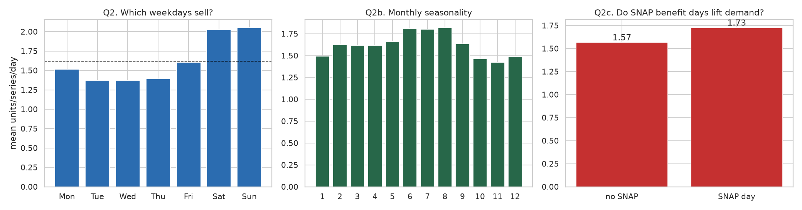
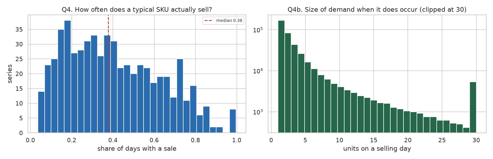
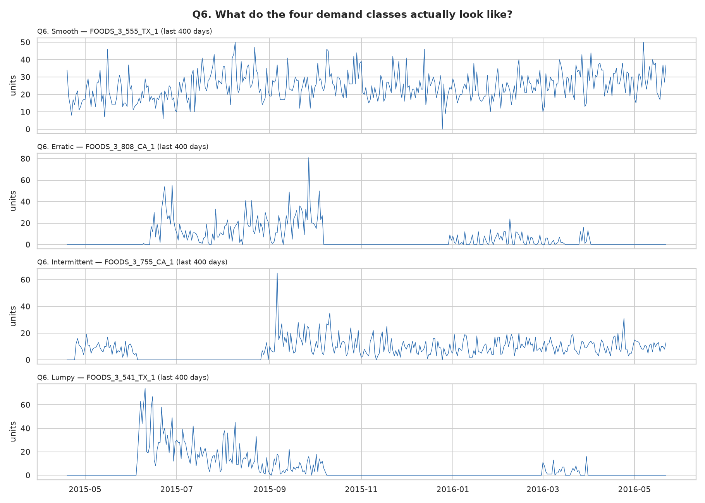

# AIML-4 — Demand Forecasting & Inventory Optimization

Forecast retail demand at **SKU × store × day**, quantify how uncertain the forecast is,
and turn both into **reorder points, safety stock and a service-level decision**.

Built on the **M5** dataset (Walmart unit sales, MOFC/Kaggle) — 1,003,600 rows, 600
SKU-store series, 1,969 days, with real prices, SNAP promotion days and a category
hierarchy.

Every number below is produced by the pipeline. `reports/model_report.md` is generated
from `reports/run_results.json`, so the write-up cannot drift from what the code did.

---

## The five findings that matter

**1. ML beats the baselines — but only on 5% of the series.** Per demand class on the
held-out test window:

| demand class | series | best model | best WAPE | best baseline | baseline WAPE | improvement |
|---|---:|---|---:|---|---:|---:|
| Smooth | 31 | **lightgbm** | 0.5175 | moving_average_28 | 0.5523 | **+6.30%** |
| Erratic | 17 | random_forest | 0.7069 | moving_average_7 | 0.7106 | +0.52% |
| Intermittent | 449 | **sba** | 0.9297 | sba | 0.9297 | **0.00%** |
| Lumpy | 103 | **sba** | 0.7974 | sba | 0.7974 | **0.00%** |

On **Intermittent and Lumpy series — 92% of the panel — the SBA baseline wins outright.**
A global gradient booster earns its place only on the smooth, high-volume minority. That
minority happens to carry 31% of demand, so the model is still worth running; but
"LightGBM is the best model" would be a false summary.

**2. Predicting zero everywhere achieves the best MASE.** On the test fold the `zero`
baseline scores MASE **0.9717**, better than LightGBM (1.0237), SBA (1.0017) and every
other method. Averaging per-row scaled errors rewards predicting nothing when 55.6% of
actuals are zero. WAPE correctly scores it **1.0000**. This is why WAPE is the headline
metric and why MAPE is not reported at all.

**3. Overall ML gains are modest.** Validation WAPE: LightGBM **0.7397** vs a 28-day
moving average **0.7503** — a 1.4% relative improvement, and +14.7% against seasonal
naive. On the held-out test the ordering even flips: random forest 0.7726, LightGBM
0.7766, MA28 0.7870.

**4. The forecast-driven inventory policy is genuinely better.** Simulated over the
held-out 28 days: **22% fewer units short** (526.7 vs 675.8) and **7.7% lower total cost**
(3,231.88 vs 3,500.94 CU) than sizing safety stock from historical demand variability —
at the cost of 11% more inventory.

**5. The economically optimal service level is 95%, and two independent methods agree.**
The simulated cost curve is U-shaped with its minimum at 95%; the newsvendor critical
ratio Cu/(Cu+Co) computes to **0.9631**. Neither is asserted — both are calculated, and
they cross-check each other.

> **Currency figures are conditional on assumptions.** Only unit value comes from the data
> (observed `sell_price`). Gross margin, holding rate, ordering cost and the stockout
> penalty are declared in `configs/config.yaml` and reported in neutral **currency units
> (CU)**. A sensitivity table shows the optimum moving with them.

---

## Business problem

Five questions, each answered by a specific artefact:

| question | artefact |
|---|---|
| How much demand should we expect? | point forecast, horizons 1/7/14/28 days |
| How uncertain is the forecast? | P10/P50/P90 with **validated** coverage |
| Which products will stock out? | ranked risk worklist from a policy simulation |
| How much inventory should we hold? | safety stock + reorder point per series |
| What is the overstock/stockout trade-off? | service-level cost curve + newsvendor check |

## Dataset and forecasting grain

| | |
|---|---|
| Source | M5 Forecasting-Accuracy (MOFC/Kaggle), public long-format mirror |
| **Grain** | **SKU × store × day** (`series_id` × `date`) |
| **Target** | `demand` — units sold, integer, non-negative |
| Panel | 1,003,600 rows · 600 series · 1,969 days (2011-01-29 → 2016-06-19) |
| Subset | 200 SKUs × 3 stores (CA_1, TX_1, WI_1), stratified, seed 42 |
| Exogenous | `sell_price` (real), `snap` (SNAP benefit days, ~33% of days), category hierarchy |
| Held-out test | **2016-05-23 → 2016-06-19** (the official M5 evaluation window) |

**Why a subset.** 30,490 series is more than this project needs, and the requirement is
explicitly not to fit expensive models on every SKU blindly. Sampling is **stratified over
category × demand class**, not top-N by volume — ranking by volume would have silently
removed the intermittent series that make demand forecasting hard. It worked: the subset's
demand-class mix (Intermittent 74.8% / Lumpy 17.2% / Smooth 5.2% / Erratic 2.8%) closely
tracks the full population (72.5 / 18.4 / 6.2 / 2.8).

**Why the test window is usable.** The mirror's `temporal` file extends 28 days past the
training target, so price and SNAP exist for the holdout. The 28-day window can therefore
be scored with the same feature set as training, rather than degraded features.

## Data quality

Full detail in **[reports/data_audit.md](./reports/data_audit.md)** (generated).

| check | result |
|---|---|
| Duplicates on `(series_id, date)` | **0** |
| Series with internal calendar gaps | **0** |
| Negative demand | **0** |
| Missing values | **none** |
| Values outside valid ranges | **none** |
| Zero share | **58.90%** |
| Series launching after the panel opens | **435** of 600 |
| Spike days above 20× the series' own non-zero median | **13** across 8 series (kept) |

### Is a zero a real zero?

The most consequential question in a demand panel, because three different things look
identical in the target column:

| zero type | rows | share of zeros | treatment |
|---|---:|---:|---|
| pre-launch (not yet stocked) | 0 | 0.0% | excluded upstream; series trimmed to first sale |
| post-discontinuation | 1,931 | 0.3% | series has ended; flagged, not forecast |
| **true zero (on shelf, no sale)** | **589,144** | **99.7%** | real signal; must be modelled |

Treating pre-launch and post-delisting zeros as demand teaches the model that demand
collapses at the start and end of a product's life — an artefact of the panel's shape, not
a property of demand.

### Leakage: proven, not asserted

Features are rebuilt after **overwriting every actual past the forecast origin with
nonsense**. Any feature that changes was reading data unavailable at forecast time.

```
features checked : 51
rows compared    : 1,800
features changed : none
leak-free        : True
```

And the probe is proven capable of failing: a test injects the classic mistake — a
`rolling_mean_7` computed at the *target* date via a panel-wide `groupby().shift()` — and
asserts the probe catches it. A check that cannot fail proves nothing.

**One place future information legitimately enters:** `sell_price`, `snap` and the calendar
for the **target date**. A retailer sets prices and promo calendars in advance. That is an
assumption about the business process, declared in `configs/config.yaml` under
`features.assume_known_future`.

## EDA findings



| finding | value |
|---|---|
| Mean demand | 1.619 units/series/day |
| Weekday peak | **Sunday**, max/min ratio **1.50** |
| SNAP-day demand lift | **+10.2%** |
| Top 20% of series | **73.4%** of all demand |
| Median SKU sells on | **38%** of days |
| Growth, first → last 8 weeks | **+38.1%** |



Demand is simultaneously **highly concentrated** and **highly intermittent**. Those two
facts pull forecasting in opposite directions, which is why every result here is reported
per segment as well as in aggregate.



## Feature engineering

All target-derived features are computed **as of the forecast origin**, never as of the
target date. To forecast `origin + 14`, the model may use demand up to `origin`; it may not
use a lag measured from the target date, because that would be `origin + 13` — a day that
has not happened yet.

| group | features |
|---|---|
| Lags (back from the origin) | `lag_1`, `lag_7`, `lag_14`, `lag_28` |
| Rolling (windows ending at the origin) | `rolling_{mean,std,max}_{7,14,28}`, `nonzero_rate_{7,14,28}` |
| Intermittency state | `days_since_last_sale`, `mean_nonzero_size_28`, `croston_at_origin`, `sba_at_origin` |
| Series level | `hist_mean`, `hist_std`, `hist_nonzero_rate`, `series_age_days`, `trend_7_28` |
| Calendar (target date) | `dow`, `day_of_month`, `week_of_year`, `month`, `quarter`, `year`, weekend/month-edge flags, `is_holiday`, `days_to_holiday`, cyclical sin/cos |
| Business | `sell_price`, `snap`, `discount_vs_28d`, `price_ratio_vs_origin`, `product_age_days` |
| Categorical | `sku_id`, `dept_id`, `cat_id`, `store_id`, `state_id` |

Features are computed once per origin and **shared across all horizons**, with `horizon`
itself as a feature, so one model serves 1–28 days ahead.

Top features by LightGBM gain: `rolling_mean_28`, `rolling_mean_14`, `sku_id`, `hist_mean`,
**`croston_at_origin`** — the intermittent-demand feature ranks 5th of 51.

## Models and validation

**Rolling-origin (walk-forward) validation, refitted per fold.** 4 consecutive
non-overlapping 28-day windows, expanding training window, all ending before the test
window opens.

```
fold_1  origin 2016-01-31  predict 2016-02-01..2016-02-28
fold_2  origin 2016-02-28  predict 2016-02-29..2016-03-27
fold_3  origin 2016-03-27  predict 2016-03-28..2016-04-24
fold_4  origin 2016-04-24  predict 2016-04-25..2016-05-22
TEST    origin 2016-05-22  predict 2016-05-23..2016-06-19
```

**Why not a random split.** It would place day *t+1* in training and day *t* in test for
the same series, letting the model interpolate between days it has already seen and
reporting an accuracy no deployed forecaster can reach. Refitting per fold is also
necessary: reusing one model fitted on all training data would let fold 1 be scored by a
model that had seen fold 4.

A subtler trap the code guards against: a training row is `(origin, horizon)` with its
label at `origin + horizon`, so the latest safe training origin is
`fold.origin − max_horizon`, not `fold.origin`. An assertion catches it, and it fired
during development.

### Validation results (mean across 4 folds)

| model | MAE | RMSE | **WAPE** | WAPE sd | MASE | bias | skill vs seasonal naive |
|---|---:|---:|---:|---:|---:|---:|---:|
| **lightgbm** | 1.0311 | 2.2453 | **0.7397** | 0.0480 | 0.9489 | −0.0368 | **+14.66%** |
| random_forest | 1.0417 | 2.2568 | 0.7473 | 0.0353 | 0.9597 | −0.0389 | +13.78% |
| moving_average_28 | 1.0455 | 2.2941 | 0.7503 | 0.0402 | 0.9492 | −0.0403 | +13.44% |
| moving_average_7 | 1.0536 | 2.2890 | 0.7558 | 0.0323 | 0.9582 | −0.0653 | +12.80% |
| sba | 1.1001 | 2.3672 | 0.7901 | 0.0606 | 0.9796 | −0.0110 | +8.85% |
| croston | 1.1150 | 2.3796 | 0.8008 | 0.0617 | 0.9941 | +0.0619 | +7.61% |
| seasonal_naive | 1.2083 | 2.7940 | 0.8668 | 0.0396 | 1.0670 | −0.0653 | 0.00% |
| zero | 1.3958 | 3.8260 | 1.0000 | 0.0000 | **0.9420** | −1.3958 | −15.37% |
| naive | 1.4090 | 3.1630 | 1.0105 | 0.0817 | 1.1974 | +0.3421 | −16.58% |

### Held-out test (28 days, never used for fitting or selection)

| model | MAE | RMSE | **WAPE** | MASE | skill vs seasonal naive |
|---|---:|---:|---:|---:|---:|
| **random_forest** | 1.1384 | 2.6317 | **0.7726** | 1.0291 | **+16.67%** |
| lightgbm | 1.1443 | 2.6182 | 0.7766 | 1.0237 | +16.24% |
| sba | 1.1583 | 2.7379 | 0.7861 | 1.0017 | +15.21% |
| moving_average_28 | 1.1596 | 2.7479 | 0.7870 | 1.0185 | +15.11% |
| croston | 1.1728 | 2.7673 | 0.7960 | 1.0163 | +14.15% |
| seasonal_naive | 1.3661 | 3.3294 | 0.9271 | 1.1870 | 0.00% |
| zero | 1.4735 | 4.1261 | 1.0000 | **0.9717** | −7.86% |

The ML/baseline gap on the test fold is **1.8%** of WAPE (0.7870 → 0.7726). Reported as
such rather than dressed up.

### Classical models (ETS, SARIMA) on a stratified sample of 28 series

| model | MAE | RMSE | WAPE | MASE |
|---|---:|---:|---:|---:|
| **ets** | 1.9161 | 3.5236 | **0.6307** | 0.7693 |
| sarima | 1.9745 | 3.6335 | 0.6499 | 0.7947 |
| moving_average_28 | 2.0534 | 3.6867 | 0.6758 | 0.8089 |
| sba | 2.1226 | 3.4000 | 0.6986 | 0.8451 |
| seasonal_naive | 2.3673 | 4.5851 | 0.7792 | 0.9618 |

**ETS wins on this sample** — with zero fit failures. Note the sample's zero share is
35.7% against 55.6% for the panel, so these series are denser than typical, which is
exactly where classical smoothing works. Fitted per series, so only on a sample; cost
scales with the number of series, not rows.

### Accuracy by horizon (WAPE)

| horizon | lightgbm | moving_average_28 | sba | seasonal_naive |
|---|---:|---:|---:|---:|
| 1 | 0.6512 | 0.6808 | 0.6924 | 0.8486 |
| 7 | 0.7582 | 0.7416 | 0.7503 | 0.9948 |
| 14 | 0.7410 | 0.7574 | 0.7733 | 0.9972 |
| 28 | 0.7595 | 0.7249 | 0.6936 | 0.8864 |

Error grows from day 1 then plateaus rather than rising monotonically. A footnote worth
knowing: at horizons that are exact multiples of 7, textbook seasonal naive reduces to the
plain naive forecast, because stepping back whole weeks from the target lands exactly on
the origin.

## Forecast uncertainty

P10/P50/P90 from **LightGBM quantile regression** — separate models per quantile, not a
symmetric band, because demand is skewed and floored at zero.

| nominal | empirical | gap | mean width | pinball P10 | pinball P50 | pinball P90 |
|---:|---:|---:|---:|---:|---:|---:|
| 80% | **75.04%** | **−4.96pp** | 2.9568 | 0.1474 | 0.5291 | 0.3440 |

**The interval is too narrow**, and that is reported rather than hidden — safety stock is
sized from the upper tail, so an over-confident P90 causes stockouts the service-level
target never anticipated. Two further honest notes: exact nominal coverage is unattainable
for a discrete, zero-inflated target, and interval width does not grow monotonically with
horizon, so the intervals are not fully conditioning on distance.

## Demand segmentation

Syntetos-Boylan classification on **ADI** (periods per non-zero period) and **CV²**
(squared CV of *non-zero* demand sizes), at the standard cut points ADI=1.32, CV²=0.49.
Using non-zero sizes is what makes the pair separable — computing CV² over all periods
conflates "varies a lot when it sells" with "rarely sells".

| class | series | series share | demand share | median ADI | median CV² | mean zero share |
|---|---:|---:|---:|---:|---:|---:|
| Smooth | 31 | 5.2% | **30.9%** | 1.18 | 0.35 | 0.14 |
| Erratic | 17 | 2.8% | 14.7% | 1.25 | 0.68 | 0.19 |
| Intermittent | 449 | **74.8%** | 33.6% | 3.04 | 0.30 | 0.65 |
| Lumpy | 103 | 17.2% | 20.8% | 2.10 | 0.61 | 0.54 |

5% of series carry 31% of demand. The recommended approach per segment lives in
`src/evaluation/segmentation.py::SEGMENT_ADVICE` and is tied to the measured per-segment
results above.

## Error analysis

Spearman correlation between series characteristics and that series' WAPE:

| characteristic | ρ vs WAPE |
|---|---:|
| zero_share | **+0.5722** |
| mean_demand | **−0.5701** |
| cv_demand | +0.5460 |
| total_demand | −0.5012 |
| weekly_strength | −0.3435 |
| snap_share | +0.0508 |
| history_days | −0.0308 |
| price_cv | −0.0226 |

**What causes forecast error:** sparsity and low volume, not lack of history or price
movement. Series with more zeros and less demand are harder, and a stronger weekly cycle
makes a series easier. History length is essentially irrelevant — more data does not help
if the series is mostly zeros.

**Promotions are where the model is weakest:** WAPE **0.8033** on SNAP days vs **0.7619**
on other days, a 5.4% relative degradation on precisely the days when demand spikes and a
stockout is most visible.

## Inventory optimization

**Safety stock is derived from the spread of lead-time forecast error, not from historical
demand variability.** This is the whole reason forecasting has value: a better forecast
shrinks the error spread and therefore the stock required. Sizing from demand variability
returns the same answer no matter how good the forecast is, and so can never demonstrate
any benefit from improving it.

```
protection window = 7 d lead time + 7 d review period = 14 days of exposure
```

Under periodic review the exposure is lead time **plus** the review period — a stockout can
occur any time before the *next* order arrives. Omitting the review period systematically
under-protects.

Error spread is estimated from **60 lead-time windows per series** (multiple origins stepped
through each validation fold, reusing that fold's model so every prediction stays
out-of-sample). This matters: an earlier version used one window per fold, and with 4
observations the empirical quantile was pure noise and performed *worse* than the normal
approximation.

| estimator | mean safety stock (units) |
|---|---:|
| normal approximation, z(95%)·σ | 11.60 |
| empirical 95th percentile of error | 11.92 |

Median ratio **0.987** — with 60 windows the two agree to within 1.3%, so on this panel the
Gaussian approximation is adequate. That is a measured conclusion, not an assumption; the
code prints the skewed-tail warning only when the ratio actually diverges.

### Baseline vs forecast-driven policy, simulated on the held-out 28 days

| policy | units short | fill rate | cycle SL | avg inventory | series with stockout |
|---|---:|---:|---:|---:|---:|
| baseline (demand variability) | 675.8 | 0.9727 | 0.9742 | 15,650 | 47 |
| **forecast, normal SS** | **526.7** | **0.9787** | **0.9825** | 17,431 | **32** |
| forecast, empirical SS | 643.9 | 0.9740 | 0.9788 | 17,634 | 41 |

| policy | holding | stockout | ordering | **total (CU)** |
|---|---:|---:|---:|---:|
| baseline (demand variability) | 1,040.11 | 626.83 | 1,834.00 | 3,500.94 |
| **forecast, normal SS** | 1,155.86 | **336.03** | 1,740.00 | **3,231.88** |
| forecast, empirical SS | 1,184.14 | 450.63 | 1,748.00 | 3,382.77 |

The forecast-driven policy cuts units short by **22%** and stockout cost by **46%**, for
11% more inventory and **7.7% lower total cost**. Simulation treats unmet demand as **lost
sales**, not backorders.

## Scenario analysis

| service level | z | mean safety stock | achieved fill rate | units short | avg inventory | holding | stockout | **total (CU)** |
|---:|---:|---:|---:|---:|---:|---:|---:|---:|
| 90% | 1.2816 | 9.04 | 0.9724 | 682.6 | 15,914 | 1,057.47 | 483.91 | 3,279.38 |
| **95%** | 1.6449 | 11.60 | 0.9787 | 526.7 | 17,431 | 1,155.86 | 336.03 | **3,231.88** |
| 99% | 2.3263 | 16.41 | 0.9860 | 346.5 | 20,272 | 1,342.46 | 206.01 | 3,294.47 |

The cost curve is **U-shaped with its minimum at 95%**. Independently, the newsvendor
critical ratio Cu/(Cu+Co) = **0.9631** (Cu 2.261 CU vs Co 0.0867 CU over 28 days). The
closed form and the simulation agree — which is the point of computing both.

### Sensitivity: the recommendation depends on an assumption the data cannot supply

| stockout penalty multiplier | cost-optimal service level | total cost (CU) | fill rate |
|---:|---:|---:|---:|
| 1.0 | **90%** | 3,037.43 | 0.9724 |
| 2.0 | **95%** | 3,231.88 | 0.9787 |
| 4.0 | **99%** | 3,500.48 | 0.9860 |

## Business recommendations

1. **Run the global ML model only where it pays.** Use LightGBM for Smooth and Erratic
   series (6.3% WAPE improvement on Smooth, which carry 31% of demand). Use **SBA** for the
   Intermittent and Lumpy majority, where ML adds nothing measurable and SBA is cheaper,
   explainable and already the winner.
2. **Adopt the forecast-driven reorder points at a 95% service level** — 22% fewer units
   short and 7.7% lower total cost than the demand-variability baseline, under the stated
   economics.
3. **Re-examine the stockout penalty before fixing the service level.** It is the single
   assumption that moves the answer between 90% and 99%.
4. **Treat promotion days as a separate problem.** The model is 5.4% worse on SNAP days;
   a promotion-specific uplift model would target the error where it costs most.
5. **Don't expect forecasting to fix the long tail.** Error is driven by sparsity and low
   volume. For the 449 intermittent series, the lever is inventory policy and service-level
   choice, not forecast accuracy.

## Answers to the final questions

1. **Best model?** LightGBM on validation WAPE (0.7397); random forest edged it on the test
   fold (0.7726 vs 0.7766). ETS was best on the denser sampled subset.
2. **Did ML meaningfully beat the baselines?** Only for Smooth series (+6.3%). Overall the
   gap over a 28-day moving average is 1.4% (validation) and 1.8% (test), and on 92% of
   series the SBA baseline wins.
3. **Hardest products?** Intermittent and Lumpy: `sba` WAPE 0.9297 on Intermittent versus
   0.5175 for the best Smooth model.
4. **What causes error?** Sparsity (ρ +0.57 with zero share), low volume (ρ −0.57), and
   volatility (ρ +0.55). Not history length, not price movement.
5. **How does uncertainty affect inventory?** Safety stock is a direct function of the
   lead-time error spread: 11.60 units at 95% vs 16.41 at 99%. Because the P10–P90 interval
   under-covers by 5pp, quantile-based stock is slightly optimistic and the error-spread
   estimator is preferred.
6. **What service level is reasonable?** **95%** under the default assumptions, agreeing
   with a newsvendor ratio of 0.9631 — but 90% if a stockout costs only the lost margin,
   and 99% if it costs 4×.
7. **Forecast-driven vs baseline policy?** Better on both service and cost: fill rate
   0.9787 vs 0.9727, units short −22%, total cost −7.7%, for 11% more inventory.

## How to run

```bash
pip install -r requirements.txt

make download     # fetch the M5 source files (~133 MB, public mirror, no credentials)
make panel        # build the modelling panel
make all          # audit -> eda -> baselines -> train -> classical -> inventory -> scenarios -> forecast -> report
make test         # 60 tests
make lint         # ruff
make app          # Streamlit decision dashboard
```

Without network access, `make sample` generates a synthetic panel that reproduces the
schema **and the quirks** (intermittency, all four demand classes, staggered launches, a
discontinued series, price steps, SNAP flags, spikes), so the pipeline and tests run
offline.

`make train` takes ~15 minutes: it refits every model on every fold, which is the correct
but expensive choice.

Forecasting a single series:

```python
from src.inference.forecaster import DemandForecaster
from src.data.loader import load_panel
from src.config import load_config

cfg = load_config()
f = DemandForecaster.load(cfg)
rec = f.recommend(load_panel(cfg), "FOODS_3_555_TX_1")
print(rec.reorder_point, rec.safety_stock, rec.stockout_risk)
```

### Example output

```
DEMAND FORECAST & REORDER RECOMMENDATION — FOODS_3_555_TX_1
  forecast origin       : 2016-05-22
  horizon               : 28 days
  total forecast demand : 818.4 units
  lead time + review    : 7 + 7 = 14 days of exposure
  expected LT demand    : 412.3 units
  safety stock          : 27.7 units (at 95% service level)
  REORDER POINT         : 441 units
  stockout risk         : 4.4% (normal approximation)
```

## Project structure

```
aiml4-demand-forecasting-inventory-optimization/
├── configs/config.yaml       grain, splits, features, models, inventory economics
├── data/raw/                 gitignored; fetched by src/data/download.py
├── data/processed/           panel + predictions + policy (gitignored)
├── notebooks/                01..08, thin wrappers over src/
├── models/                   bundle + human-readable metadata sidecar
├── reports/
│   ├── data_audit.md         generated
│   ├── model_report.md       generated from run_results.json
│   └── figures/              6 EDA figures
├── src/
│   ├── config.py             path resolution; no hardcoded paths
│   ├── eda.py                six business questions
│   ├── run.py                stage runner
│   ├── reporting.py          renders model_report.md
│   ├── data/                 schema, loader (grain + folds), download, sample, audit
│   ├── features/             calendar, build (origin-anchored, leak-free)
│   ├── forecasting/          baselines, classical (ETS/SARIMA), ml (global LGBM), persist
│   ├── evaluation/           metrics, validate (walk-forward), segmentation, errors, uncertainty
│   ├── inventory/            policy (safety stock/ROP), simulate, costs (+ newsvendor)
│   └── inference/            forecaster (forecast -> decision)
├── app/streamlit_app.py      decision dashboard
├── tests/                    60 tests
└── tools/build_notebooks.py  generates the notebooks from one source
```

## Reproducibility

- One seed (`project.seed: 42`) threads through subset selection, CV, and models.
- Everything that affects a result lives in `configs/config.yaml`.
- The persisted bundle carries the model, quantile models, feature list, config,
  **the inventory assumptions the reorder points depend on**, and library versions; a
  version mismatch warns on load.
- `reports/model_report.md` is generated from recorded results, so it cannot drift.
- Verified on Python 3.11.15, pandas 3.0.5, LightGBM 4.7.0, scikit-learn 1.9.0,
  statsmodels 0.15.0.

## Limitations

- **The economics are assumptions.** Only unit value is measured. The optimal service level
  moves from 90% to 99% across the sensitivity grid.
- **600 of 30,490 series.** Stratified and seeded, but absolute accuracy would differ on the
  full panel; the *ranking* of methods is the transferable result.
- **Named holiday events are absent** from this mirror. Holiday flags are derived from
  pandas' US federal calendar and miss retail-specific events, which is likely part of why
  promotion-day accuracy is weakest.
- **Price and promo for the target date are assumed known** — true for a planned promo
  calendar, false for reactive competitor pricing.
- **Prediction intervals under-cover** by ~5pp, so quantile-based safety stock is optimistic.
- **Lead time is deterministic.** Real lead times vary, and lead-time variance usually
  contributes more to required safety stock than demand variance does.
- **Demand is assumed observed.** A stockout censors demand, so the target understates true
  demand for exactly the series that stocked out — which biases safety stock downward where
  it is most needed.
- **ETS/SARIMA were compared against baselines on their sample**, not against the global ML
  model across all series.

## Future improvements

- Model **censored demand**, since observed sales understate demand during stockouts.
- Add **stochastic lead time**, which typically dominates demand uncertainty in safety-stock
  sizing.
- Fit **per-segment models** rather than one global model, given that baselines win on the
  intermittent majority.
- **Hierarchical reconciliation** across SKU / department / store for coherent forecasts.
- Replace quantile regression with **conformal prediction** for coverage guarantees that
  hold without distributional assumptions.
- A **promotion uplift model** for SNAP and price-cut days, where error is concentrated.

---

Part of the [AI/ML portfolio](../README.md). Companion projects:
[AIML-1 — Payment Fraud Detection](../aiml1-payment-fraud-detection),
[AIML-3 — Customer Churn & Explainable ML](../aiml3-customer-churn-explainable-ml).
