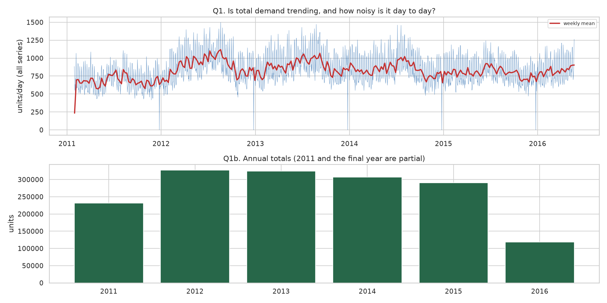
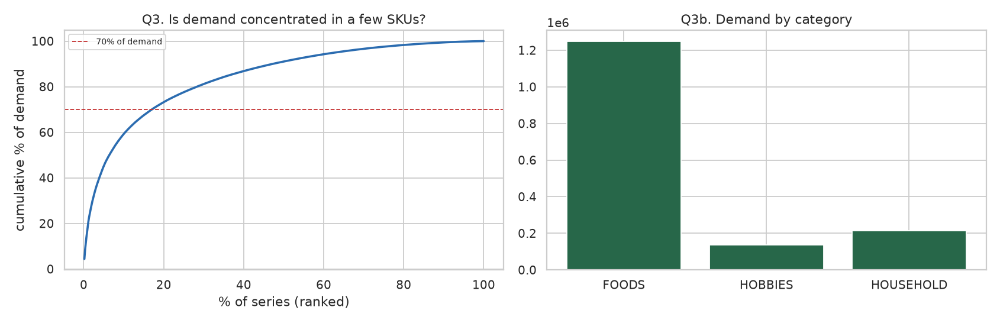
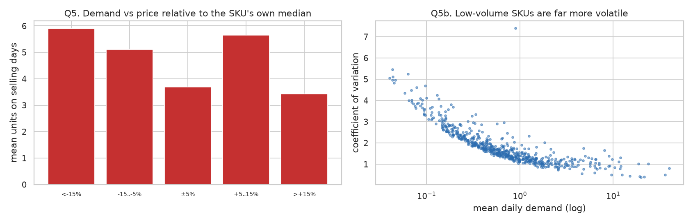

# Model Report — Demand Forecasting & Inventory Optimization

Generated by `python -m src.run report` from `reports/run_results.json`. Every number is produced by the pipeline.

> **Currency figures are conditional on assumptions.** Only unit value comes from the data (observed `sell_price`). Margin, holding rate, ordering cost and the stockout penalty are declared in `configs/config.yaml` and reported in neutral currency units (CU).

## 1. Data, grain and quality

- Grain: **SKU x store x day**; target `demand` in units
- Panel: **1,003,600 rows**, 600 series, 1,969 days (2011-01-29 to 2016-06-19)
- Duplicates on the grain: **0**; series with internal calendar gaps: **0**
- Negative demand: **0**; missing values: `none`
- Zero share: **58.90%**, of which **99.7%** are true in-life zeros (0 pre-launch, 1,931 post-delisting)
- Series launching after the panel opens: **435**; discontinuation candidates: **0**
- Spike days above 20x the series' own non-zero median: **13** across 8 series (kept, not clipped)

Demand character: **92.0%** of series are Intermittent or Lumpy. `{'Intermittent': 449, 'Lumpy': 103, 'Smooth': 31, 'Erratic': 17}`

**Leakage probe:** features rebuilt after overwriting every actual past the origin — **54 features**, 1,800 rows, changed: `none`, **leak-free: True**

Full detail in [data_audit.md](./data_audit.md).

## 2. Exploratory findings

- Mean demand **1.619** units/series/day; zero share **58.95%**
- Weekday peak **Sun**, max/min ratio **1.50**
- SNAP days lift demand **+10.2%**
- Top 20% of series carry **73.4%** of demand
- Median SKU sells on only **0.38** of days
- Demand grew **+38.1%** from the first to the last 8 weeks








## 3. Validation strategy

Rolling-origin (walk-forward) validation: **4 folds**, 28-day horizon, expanding window, refitted per fold. The held-out test window is the official M5 evaluation period **2016-05-23 to 2016-06-19**, never used for fitting or model selection.

A random split would place day *t+1* in training and day *t* in test for the same series, letting the model interpolate between days it has already seen and reporting an accuracy no deployed forecaster can reach.

## 4. Model comparison

Mean across validation folds:

| model | mae | rmse | wape | wape_std | mase | bias | skill_vs_seasonal_naive_pct |
|---|---|---|---|---|---|---|---|
| lightgbm | 1.0311 | 2.2453 | 0.7397 | 0.0480 | 0.9489 | -0.0368 | 14.6596 |
| random_forest | 1.0417 | 2.2568 | 0.7473 | 0.0353 | 0.9597 | -0.0389 | 13.7817 |
| moving_average_28 | 1.0455 | 2.2941 | 0.7503 | 0.0402 | 0.9492 | -0.0403 | 13.4363 |
| moving_average_7 | 1.0536 | 2.2890 | 0.7558 | 0.0323 | 0.9582 | -0.0653 | 12.8049 |
| sba | 1.1001 | 2.3672 | 0.7901 | 0.0606 | 0.9796 | -0.0110 | 8.8489 |
| croston | 1.1150 | 2.3796 | 0.8008 | 0.0617 | 0.9941 | 0.0619 | 7.6130 |
| seasonal_naive | 1.2083 | 2.7940 | 0.8668 | 0.0396 | 1.0670 | -0.0653 | 0.0000 |
| zero | 1.3958 | 3.8260 | 1.0000 | 0.0000 | 0.9420 | -1.3958 | -15.3725 |
| naive | 1.4090 | 3.1630 | 1.0105 | 0.0817 | 1.1974 | 0.3421 | -16.5782 |

WAPE per fold — a single lucky fold cannot hide here:

| model | fold_1 | fold_2 | fold_3 | fold_4 |
|---|---|---|---|---|
| naive | 1.1160 | 1.0273 | 0.9259 | 0.9726 |
| seasonal_naive | 0.9051 | 0.8948 | 0.8442 | 0.8229 |
| moving_average_7 | 0.7837 | 0.7776 | 0.7487 | 0.7131 |
| moving_average_28 | 0.7635 | 0.7938 | 0.7463 | 0.6977 |
| croston | 0.8179 | 0.8703 | 0.7931 | 0.7218 |
| sba | 0.8094 | 0.8561 | 0.7838 | 0.7110 |
| zero | 1.0000 | 1.0000 | 1.0000 | 1.0000 |
| lightgbm | 0.8017 | 0.7497 | 0.7173 | 0.6901 |
| random_forest | 0.7769 | 0.7759 | 0.7315 | 0.7050 |

### Held-out test (2016-05-23 to 2016-06-19)

| model | mae | rmse | wape | mase | bias | skill_vs_seasonal_naive_pct |
|---|---|---|---|---|---|---|
| random_forest | 1.1384 | 2.6317 | 0.7726 | 1.0291 | -0.0406 | 16.6655 |
| lightgbm | 1.1443 | 2.6182 | 0.7766 | 1.0237 | -0.0619 | 16.2354 |
| sba | 1.1583 | 2.7379 | 0.7861 | 1.0017 | -0.0174 | 15.2126 |
| moving_average_28 | 1.1596 | 2.7479 | 0.7870 | 1.0185 | 0.0017 | 15.1124 |
| croston | 1.1728 | 2.7673 | 0.7960 | 1.0163 | 0.0592 | 14.1467 |
| moving_average_7 | 1.2055 | 2.8828 | 0.8181 | 1.0594 | 0.0327 | 11.7572 |
| seasonal_naive | 1.3661 | 3.3294 | 0.9271 | 1.1870 | 0.0327 | 0.0000 |
| zero | 1.4735 | 4.1261 | 1.0000 | 0.9717 | -1.4735 | -7.8606 |
| naive | 1.6707 | 5.1312 | 1.1339 | 1.3668 | 0.6315 | -22.3007 |

### Accuracy by horizon

| horizon | croston | lightgbm | moving_average_28 | moving_average_7 | naive | random_forest | sba | seasonal_naive | zero |
|---|---|---|---|---|---|---|---|---|---|
| 1 | 0.7047 | 0.6512 | 0.6808 | 0.7017 | 1.0751 | 0.6572 | 0.6924 | 0.8486 | 1.0000 |
| 7 | 0.7512 | 0.7582 | 0.7416 | 0.7338 | 0.9948 | 0.7522 | 0.7503 | 0.9948 | 1.0000 |
| 14 | 0.7691 | 0.7410 | 0.7574 | 0.8050 | 0.9972 | 0.7400 | 0.7733 | 0.9972 | 1.0000 |
| 28 | 0.6924 | 0.7595 | 0.7249 | 0.7304 | 0.8864 | 0.7574 | 0.6936 | 0.8864 | 1.0000 |

### Classical models (ETS, SARIMA) on a stratified sample

Fitted per series on **28 of 600** series. Fit failures: `{'ets': 0, 'sarima': 0}`.

| model | mae | rmse | wape | mase | bias |
|---|---|---|---|---|---|
| ets | 1.9161 | 3.5236 | 0.6307 | 0.7693 | -0.1755 |
| sarima | 1.9745 | 3.6335 | 0.6499 | 0.7947 | -0.3434 |
| moving_average_28 | 2.0534 | 3.6867 | 0.6758 | 0.8089 | -0.0587 |
| sba | 2.1226 | 3.4000 | 0.6986 | 0.8451 | 0.5058 |
| croston | 2.1894 | 3.5098 | 0.7206 | 0.8613 | 0.6923 |
| seasonal_naive | 2.3673 | 4.5851 | 0.7792 | 0.9618 | -0.1505 |

- Fitted on a stratified sample of 28 of 600 series.
- Both models are unconstrained and can forecast negative demand on intermittent series; predictions are clipped at zero.

### Why MAPE is not reported

With **59%** of observations equal to zero, MAPE is undefined on most rows. WAPE is the headline because it only needs aggregate demand to be non-zero. MASE is reported for scale-free comparison, with one caveat visible in the tables: **the `zero` baseline attains the best MASE**, because averaging per-row scaled errors rewards predicting nothing on sparse series. WAPE correctly assigns it a score of 1.0.

## 5. Demand segmentation and per-segment model choice

Syntetos-Boylan cut points: ADI=1.32 (periods per non-zero period) and CV²=0.49 (squared coefficient of variation of non-zero demand sizes). These are the standard literature values and are not tuned here.

| demand_class | series | series_share | demand_share | mean_daily_demand | median_ADI | median_CV2 | mean_zero_share |
|---|---|---|---|---|---|---|---|
| Erratic | 17 | 0.0283 | 0.1468 | 7.4691 | 1.2466 | 0.6782 | 0.1905 |
| Intermittent | 449 | 0.7483 | 0.3364 | 0.7349 | 3.0379 | 0.3006 | 0.6520 |
| Lumpy | 103 | 0.1717 | 0.2079 | 1.7926 | 2.0973 | 0.6141 | 0.5440 |
| Smooth | 31 | 0.0517 | 0.3090 | 8.8724 | 1.1769 | 0.3548 | 0.1355 |

**Which model wins where** — the answerable version of "which model is best":

| demand_class | n | best_model | best_wape | best_baseline | baseline_wape | improvement_pct |
|---|---|---|---|---|---|---|
| Erratic | 476 | random_forest | 0.7069 | moving_average_7 | 0.7106 | 0.5226 |
| Intermittent | 12572 | sba | 0.9297 | sba | 0.9297 | 0.0000 |
| Lumpy | 2884 | sba | 0.7974 | sba | 0.7974 | 0.0000 |
| Smooth | 868 | lightgbm | 0.5175 | moving_average_28 | 0.5523 | 6.3022 |

On **Intermittent, Lumpy** series the ML model does not beat the best baseline by any operationally meaningful margin. Recommended approach per segment is in `src/evaluation/segmentation.py::SEGMENT_ADVICE`.

## 6. Error analysis

Spearman correlation between series characteristics and series WAPE:

| characteristic | spearman_vs_wape | n |
|---|---|---|
| zero_share | 0.5722 | 412 |
| mean_demand | -0.5701 | 412 |
| cv_demand | 0.5460 | 412 |
| total_demand | -0.5012 | 412 |
| weekly_strength | -0.3435 | 412 |
| snap_share | 0.0508 | 412 |
| history_days | -0.0308 | 412 |
| price_cv | -0.0226 | 412 |

Accuracy on SNAP (promotion-like) days versus other days:

| condition | n | mean_actual | wape | mae | bias |
|---|---|---|---|---|---|
| snap_day | 6000 | 1.4682 | 0.8033 | 1.1793 | -0.0169 |
| non_snap_day | 10800 | 1.4764 | 0.7619 | 1.1248 | -0.0868 |

Hardest series (highest WAPE, restricted to series with enough demand to be meaningful):

| series_id | demand_class | volume_class | total_actual | wape | bias | zero_share | cv_demand | weekly_strength |
|---|---|---|---|---|---|---|---|---|
| FOODS_3_764_TX_1 | Smooth | A | 54.0000 | 3.7385 | 6.7919 | 0.1826 | 0.7859 | 0.0389 |
| FOODS_3_749_CA_1 | Lumpy | B | 13.0000 | 3.2437 | 1.1970 | 0.7476 | 2.4558 | 0.0089 |
| FOODS_3_424_CA_1 | Intermittent | B | 12.0000 | 3.0092 | 0.8846 | 0.3560 | 1.1403 | 0.0208 |
| FOODS_1_138_WI_1 | Lumpy | C | 11.0000 | 2.9091 | 0.7322 | 0.7330 | 2.1803 | 0.0026 |
| FOODS_3_812_TX_1 | Intermittent | B | 12.0000 | 2.6202 | 0.5406 | 0.5211 | 1.3804 | 0.0116 |
| FOODS_3_192_CA_1 | Intermittent | B | 26.0000 | 2.5851 | 1.9836 | 0.3261 | 1.0084 | 0.0203 |
| FOODS_3_812_CA_1 | Intermittent | A | 19.0000 | 2.5298 | 1.2141 | 0.3124 | 1.0096 | 0.0301 |
| HOBBIES_1_415_CA_1 | Intermittent | B | 13.0000 | 2.4735 | 0.7323 | 0.4451 | 1.2285 | 0.0304 |
| HOUSEHOLD_2_074_TX_1 | Intermittent | B | 11.0000 | 2.4266 | 0.6701 | 0.5997 | 1.6288 | 0.0193 |
| FOODS_3_771_CA_1 | Intermittent | A | 20.0000 | 2.4070 | 1.3695 | 0.2517 | 0.8844 | 0.0456 |

Top features by LightGBM gain:

| feature | importance |
|---|---|
| rolling_mean_28 | 4068330 |
| rolling_mean_14 | 3333800 |
| sku_id | 1173844 |
| hist_mean | 623379 |
| croston_at_origin | 393505 |
| hist_std | 187714 |
| doy_sin | 182377 |
| doy_cos | 145372 |
| dow | 142002 |
| product_age_days | 141761 |
| hist_nonzero_rate | 133087 |
| mean_nonzero_size_28 | 98285 |

## 7. Forecast uncertainty

P10-P90 interval from LightGBM quantile regression, nominal coverage 80%:

| n | nominal_coverage | empirical_coverage | coverage_gap | mean_interval_width | pinball_q10 | pinball_q50 | pinball_q90 |
|---|---|---|---|---|---|---|---|
| 16800.0000 | 0.8000 | 0.7504 | -0.0496 | 2.9568 | 0.1474 | 0.5291 | 0.3440 |

Empirical coverage is **75.04%** against a nominal 80% — a gap of **-4.96%**. The interval is therefore somewhat too narrow, which matters because safety stock is sized from the upper tail. Reporting the gap is the point: an unvalidated P90 is an assumption dressed as a measurement.

Two further honesty notes. Demand is zero-inflated, so an exact nominal coverage is not attainable with a discrete, floored-at-zero target. And interval width does not grow monotonically with horizon, so the intervals are not fully conditioning on distance.

## 8. Inventory optimization

Protection window = **14 days** (7 lead + 7 review). Under periodic review the exposure is lead time **plus** the review period; omitting the review period systematically under-protects.

Safety stock is derived from the spread of **lead-time forecast error**, not from historical demand variability. That is the whole reason forecasting has value here: a better forecast shrinks the error spread and therefore the stock required. Sizing from demand variability would return the same answer no matter how good the forecast is.

- lead-time error windows per series (median): **60**
- mean safety stock at 95%: normal **11.60** units, empirical quantile **11.92** units (median ratio **0.987**)

### Baseline vs forecast-driven policy, simulated on the held-out 28 days

| policy | total_demand | units_short | fill_rate | cycle_service_level | avg_inventory_units | orders_placed | series_with_stockout |
|---|---|---|---|---|---|---|---|
| baseline_demand_variability | 24754.0000 | 675.7778 | 0.9727 | 0.9742 | 15650.0560 | 917.0000 | 47 |
| forecast_normal_ss | 24754.0000 | 526.6775 | 0.9787 | 0.9825 | 17430.6796 | 870.0000 | 32 |
| forecast_empirical_ss | 24754.0000 | 643.8810 | 0.9740 | 0.9788 | 17633.5863 | 874.0000 | 41 |

| policy | holding_cost_cu | stockout_cost_cu | ordering_cost_cu | total_cost_cu | fill_rate |
|---|---|---|---|---|---|
| baseline_demand_variability | 1040.11 | 626.83 | 1834.00 | 3500.94 | 0.97 |
| forecast_normal_ss | 1155.86 | 336.03 | 1740.00 | 3231.88 | 0.98 |
| forecast_empirical_ss | 1184.14 | 450.63 | 1748.00 | 3382.77 | 0.97 |

Best policy by total cost: **forecast_normal_ss**. Median inventory coverage **23.9 days**.

### Highest stockout risk — the operational watch list

| series_id | demand_class | volume_class | total_demand | units_short | shortfall_share | fill_rate | reorder_point |
|---|---|---|---|---|---|---|---|
| FOODS_3_808_TX_1 | Erratic | A | 338.000 | 251.361 | 0.744 | 0.256 | 42.000 |
| FOODS_3_541_TX_1 | Lumpy | A | 127.000 | 66.000 | 0.520 | 0.480 | 35.000 |
| FOODS_3_555_WI_1 | Smooth | A | 419.000 | 45.575 | 0.109 | 0.891 | 169.000 |
| FOODS_3_547_CA_1 | Lumpy | A | 177.000 | 22.251 | 0.126 | 0.874 | 74.000 |
| FOODS_3_541_CA_1 | Erratic | A | 46.000 | 22.000 | 0.478 | 0.522 | 22.000 |
| FOODS_3_547_TX_1 | Lumpy | A | 173.000 | 17.928 | 0.104 | 0.896 | 68.000 |
| FOODS_3_306_WI_1 | Smooth | A | 205.000 | 12.743 | 0.062 | 0.938 | 80.000 |
| FOODS_3_030_TX_1 | Erratic | A | 354.000 | 11.878 | 0.034 | 0.966 | 145.000 |
| FOODS_3_808_WI_1 | Erratic | A | 78.000 | 11.117 | 0.143 | 0.857 | 50.000 |
| FOODS_3_787_TX_1 | Lumpy | A | 57.000 | 11.113 | 0.195 | 0.805 | 24.000 |

## 9. Service-level scenarios and the economic optimum

| service_level | z | mean_safety_stock | achieved_fill_rate | achieved_cycle_sl | units_short | avg_inventory_units | holding_cost_cu | stockout_cost_cu | total_cost_cu | is_cost_minimum |
|---|---|---|---|---|---|---|---|---|---|---|
| 0.9000 | 1.2816 | 9.0412 | 0.9724 | 0.9746 | 682.6316 | 15913.8724 | 1057.4723 | 483.9062 | 3279.3785 | False |
| 0.9500 | 1.6449 | 11.6042 | 0.9787 | 0.9825 | 526.6775 | 17430.6796 | 1155.8570 | 336.0275 | 3231.8845 | True |
| 0.9900 | 2.3263 | 16.4120 | 0.9860 | 0.9904 | 346.4815 | 20272.1849 | 1342.4639 | 206.0097 | 3294.4736 | False |

Simulated cost-minimum service level: **95%**. The newsvendor critical ratio Cu/(Cu+Co) is **0.9631** (Cu 2.261 CU vs Co 0.0867 CU). The closed form and the simulation agree, which is the point of computing both.

### Sensitivity: the recommendation depends on the assumptions

| stockout_penalty_multiplier | cost_optimal_service_level | total_cost_cu | achieved_fill_rate | avg_inventory_units |
|---|---|---|---|---|
| 1.0000 | 0.9000 | 3037.4254 | 0.9724 | 15913.8724 |
| 2.0000 | 0.9500 | 3231.8845 | 0.9787 | 17430.6796 |
| 4.0000 | 0.9900 | 3500.4833 | 0.9860 | 20272.1849 |

## 10. Example forecast and reorder recommendation

```json
{
  "series_id": "FOODS_3_555_TX_1",
  "origin": "2016-05-22",
  "horizon_days": 28,
  "point_forecast_total": 818.3852154319485,
  "expected_lead_time_demand": 412.3,
  "safety_stock": 27.73,
  "reorder_point": 441.0,
  "stockout_risk": 0.0443,
  "service_level": 0.95,
  "lead_time_days": 7,
  "review_period_days": 7,
  "caveat": "Inventory figures use the assumed economics in configs/config.yaml; they are not measured business results."
}
```

| series_id | horizon | date | forecast | p10 | p50 | p90 |
|---|---|---|---|---|---|---|
| FOODS_3_555_TX_1 | 1 | 2016-05-23 | 27.290 | 5.119 | 24.815 | 34.966 |
| FOODS_3_555_TX_1 | 2 | 2016-05-24 | 27.197 | 5.119 | 23.782 | 34.881 |
| FOODS_3_555_TX_1 | 3 | 2016-05-25 | 27.301 | 5.119 | 23.759 | 34.727 |
| FOODS_3_555_TX_1 | 4 | 2016-05-26 | 29.442 | 5.119 | 25.064 | 34.635 |
| FOODS_3_555_TX_1 | 5 | 2016-05-27 | 30.615 | 5.119 | 25.507 | 36.843 |
| FOODS_3_555_TX_1 | 6 | 2016-05-28 | 33.777 | 5.124 | 27.229 | 40.085 |
| FOODS_3_555_TX_1 | 7 | 2016-05-29 | 34.312 | 5.124 | 27.229 | 40.159 |
| FOODS_3_555_TX_1 | 8 | 2016-05-30 | 28.088 | 5.119 | 24.387 | 39.563 |
| FOODS_3_555_TX_1 | 9 | 2016-05-31 | 27.260 | 5.119 | 23.658 | 32.938 |
| FOODS_3_555_TX_1 | 10 | 2016-06-01 | 23.845 | 5.119 | 23.886 | 33.690 |

## 11. Limitations

- **The economics are assumptions.** Only unit value is measured. The cost-optimal service level moves with the stockout penalty, as the sensitivity table shows.
- **Subset, not the full panel.** 600 of 30,490 series, stratified over category and demand class with a fixed seed. Absolute accuracy would differ on the full data; the ranking of methods is the transferable result.
- **Named holiday events are absent** from this mirror; holiday flags are derived from pandas' US federal calendar, which misses retail-specific events.
- **Price and promo for the target date are assumed known.** True for a planned promo calendar, false for reactive competitor pricing.
- **Prediction intervals under-cover** (see section 7), so quantile-based safety stock is slightly optimistic.
- **Lead time is deterministic.** Real lead times vary, and lead-time variance usually contributes more to required safety stock than demand variance does.
- **Lost sales, not backorders**, and demand is assumed observed — but a stockout censors demand, so the recorded target understates true demand for exactly the series that stocked out.
- **ETS and SARIMA were fitted on a sample** and are compared against baselines on that same sample, not against the global ML model on all series.

## 12. Future improvements

- Model **censored demand** explicitly, since observed sales understate demand during stockouts.
- Add **stochastic lead time**, which typically dominates demand uncertainty in safety-stock sizing.
- Fit **per-segment models** rather than one global model, given that the segment analysis shows baselines winning on the intermittent majority.
- Use **hierarchical reconciliation** across SKU / department / store so store and category forecasts are coherent with item forecasts.
- Replace quantile regression with **conformal prediction** for coverage guarantees that hold without distributional assumptions.
