# Multimodal Product Search

Search a product catalogue by **image**, by **natural language**, or by **both at
once** — "this shoe, but in black" — using CLIP embeddings, Qdrant vector search,
and a ranking layer that explains every result.

<p align="center">
  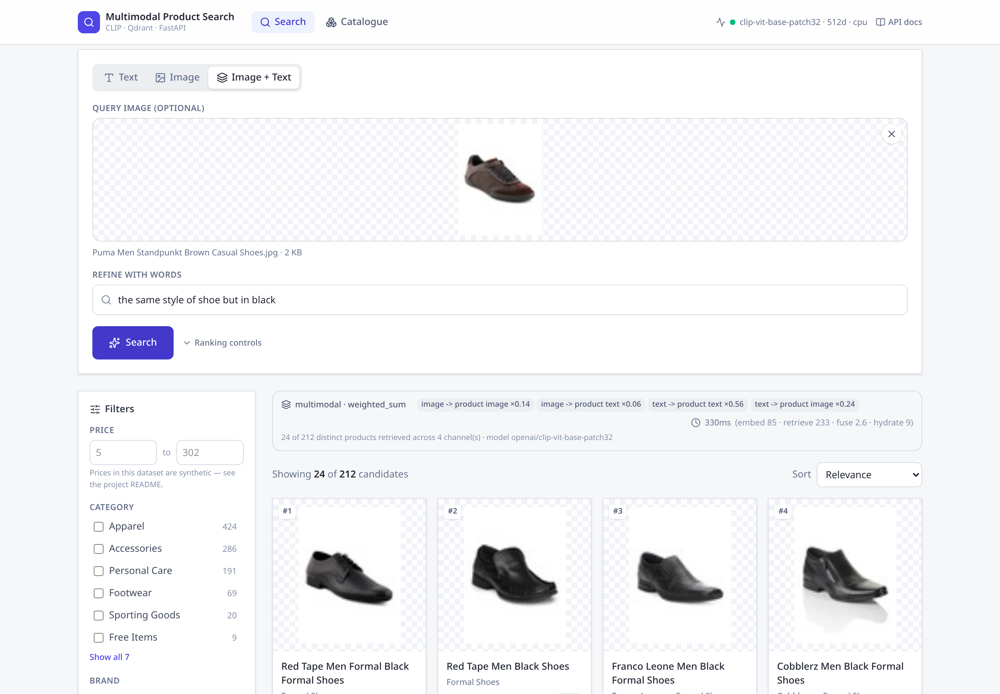
</p>
<p align="center">
  <sub>A photo of a <b>brown</b> Puma shoe plus <i>“the same style of shoe but in black”</i> →
  four <b>black</b> shoes in the top four positions. The query image's own product is pushed
  down. Each result shows its image and text similarity separately.</sub>
</p>

<p align="center">
  
  
  
  
  
  
  
</p>

---

## Contents

- [The problem](#the-problem) · [What makes this different](#what-makes-this-different)
- [Screenshots](#screenshots) · [Features](#features)
- [Quick start](#quick-start) · [Docker](#docker)
- [How multimodal retrieval works](#how-multimodal-retrieval-works)
- [Architecture](#architecture) · [Tech stack](#tech-stack)
- [Evaluation](#evaluation-measured-not-claimed) · [Experiments](#experiments-what-measurement-changed)
- [Dataset](#dataset) · [API](#api) · [Configuration](#configuration)
- [Testing](#testing) · [Project structure](#project-structure)
- [Limitations](#limitations) · [Future work](#future-work)

## The problem

Keyword search fails the moment intent is visual. A shopper holding a photo cannot
type it, and a shopper who types *"something smart for the office but not black"*
gets nothing useful from term matching. Two capabilities are missing:

1. **Search by image** — find products that *look* like this.
2. **Search by image *and* text** — take this image, and change one thing about it.

The second is the hard one, and it is where most demos stop. It requires the system
to hold two partially-conflicting signals and decide how much to trust each.

## What makes this different

This is not `image → embedding → cosine similarity → results`. Four things
distinguish it:

**1. Products are stored as two named vectors, not one fused vector.**
The obvious approach averages the image and text query embeddings and does a single
lookup. That destroys attribution: no result can be traced back to "matched
visually" versus "matched the words". Here each product carries an `image` vector
*and* a `text` vector in one Qdrant collection, producing up to five independent
retrieval channels that are fused at the *score* level — so every response can
report exactly why something ranked where it did.

**2. The modality gap is measured and compensated for.**
CLIP's image↔image cosines average **0.7305** while matched image↔text pairs
average **0.3124**. Summing those raw means the configured weights do not mean what
they say — the same-modality channel silently decides the ranking. Each channel is
normalised over its own candidate pool first.

**3. Every ranking default was chosen by measurement, and three of them
contradicted my initial guess.** `SCORE_NORMALIZATION` started as min-max
(z-score measured better), `IMAGE_WEIGHT` as 0.5 (0.2 measured better), and the
lexical channel was going to ship enabled (measurement said off). One experiment
initially produced the *wrong* conclusion until the comparison was made fair — that
story is [documented rather than quietly corrected](#experiments-what-measurement-changed).

**4. The central assumption is verified, not assumed.**
Image+text fusion only works if both towers share a comparable space. That is a
property of the training objective, so `scripts/verify_embedding_space.py` measures
it on your actual catalogue and **exits non-zero if the model fails** — usable as a
CI gate.

## Screenshots

All screenshots are of the running application against a real indexed catalogue.

| Text search | Image search |
|---|---|
| 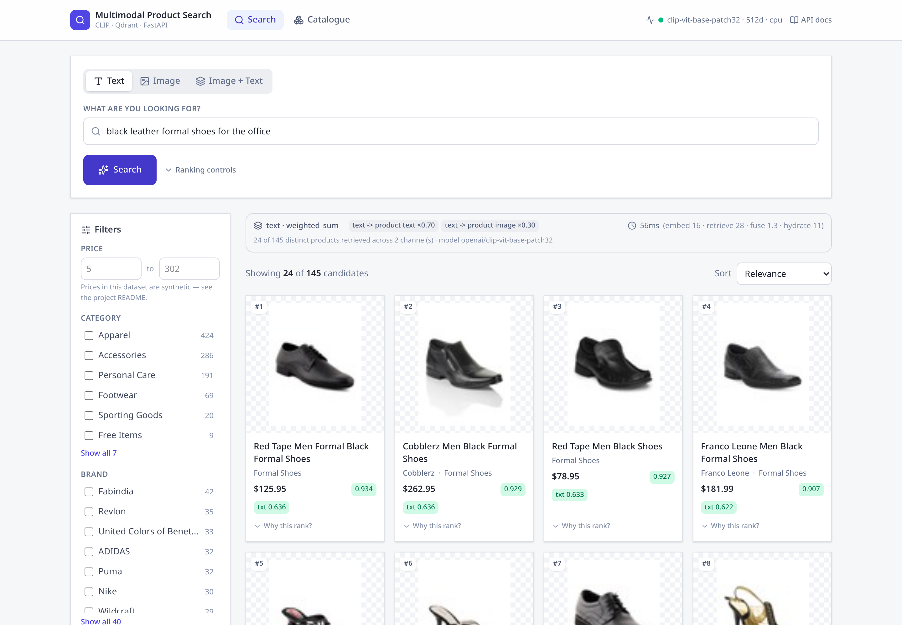 | 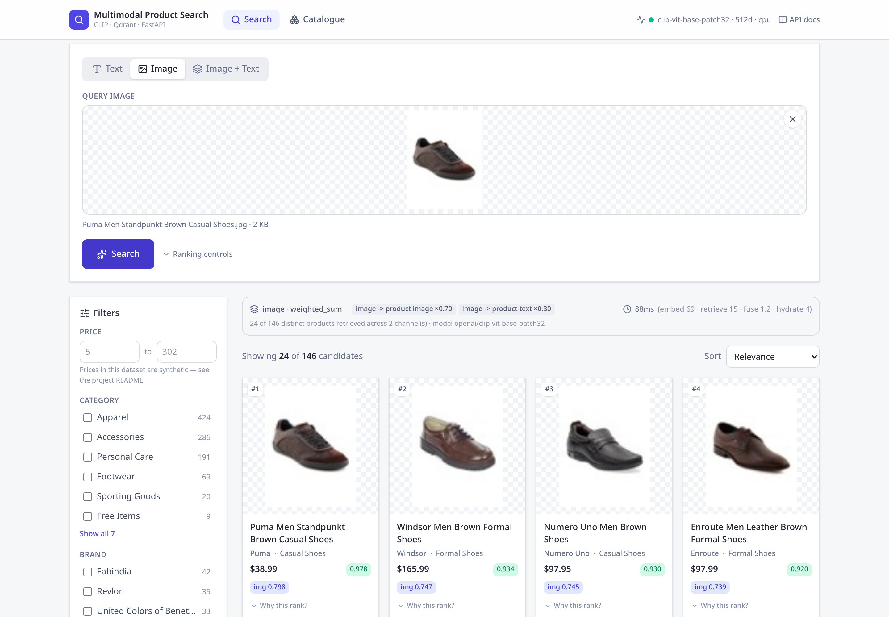 |
| Natural language over 1,000 products | Visual similarity from an uploaded photo |

| Score breakdown | Ranking controls |
|---|---|
| 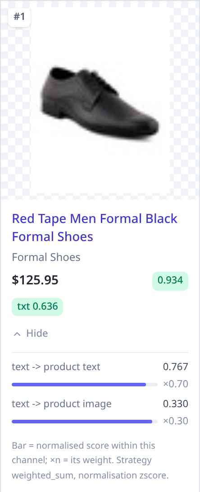 | 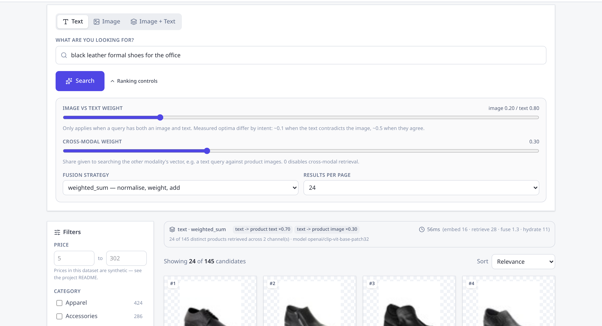 |
| Per-channel provenance for a single result | Weights and fusion strategy, live |

| Product detail | Catalogue admin |
|---|---|
| 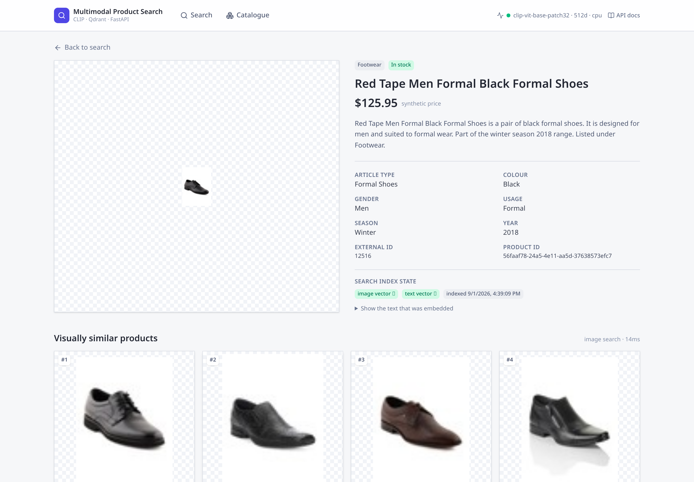 | 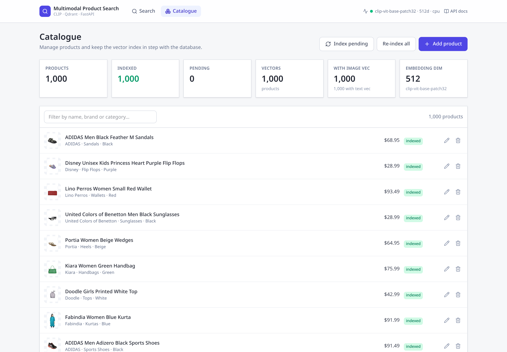 |
| Metadata, index state, and the exact embedded text | Index state, CRUD, and triggering indexing |

<details>
<summary>Filtering and mobile layout</summary>

| Faceted filtering | Mobile |
|---|---|
| 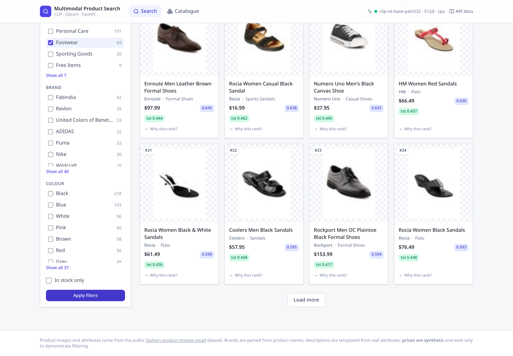 | 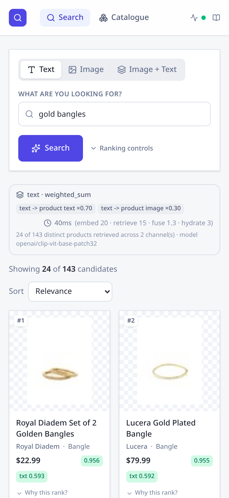 |

</details>

## Features

**Search**
- Text, image, and combined image+text search
- "More like this" from any catalogue product, reusing its stored embedding
- Faceted filtering (category, brand, colour, gender, price range, stock) pushed
  down into Qdrant rather than applied afterwards
- Sorting by relevance, price or name; pagination
- Per-result score breakdown: raw cosine, normalised score, weight and rank for
  every channel
- Three fusion strategies, overridable per request

**Catalogue**
- Full CRUD with strict validation
- Incremental indexing driven by a content fingerprint — re-indexing an unchanged
  1,000-product catalogue takes **0.1 s**
- Partial success: a product with a broken image is still indexed on text and
  records why
- Facets and index statistics for the admin view

**Engineering**
- 444 tests, 90% coverage; ranking layer at 100%
- Structured JSON logging with request-id propagation and latency breakdowns
- Three-way health split (live / ready / detailed) for correct container behaviour
- Runs with **no container runtime at all** (SQLite + embedded Qdrant) or the full
  PostgreSQL + Qdrant stack
- Alembic migrations, verified to produce zero drift against the ORM

## Quick start

No Docker required. Defaults to SQLite + embedded Qdrant.

```bash
git clone https://github.com/pavankumar05-eslavath/aiml-portfolio.git
cd aiml-portfolio/aiml5-multimodal-product-search

python3.11 -m venv .venv && source .venv/bin/activate
# requirements.txt pins the CPU torch wheel: the PyPI default is the CUDA build,
# ~2.5 GB of nvidia libraries this project never loads.
pip install -r requirements.txt

cp .env.example .env

python scripts/prepare_sample.py     # fetch images for the committed 1,000-product catalogue
python scripts/index_catalog.py      # embed + index (~47 s on CPU)

uvicorn app.main:app --app-dir backend --reload
```

In a second terminal:

```bash
cd frontend && npm install && npm run dev
```

Open **http://localhost:5173** — API docs at **http://localhost:8000/docs**.

<details>
<summary>Or use the Makefile</summary>

```bash
make venv && make env && make sample && make index
make api     # terminal 1
make ui      # terminal 2
make help    # everything else
```
</details>

First run downloads ~600 MB of CLIP weights from Hugging Face. Run all commands
from the repository root — `.env` uses paths relative to it.

## Docker

```bash
cp .env.example .env
docker compose up --build -d      # postgres + qdrant + api + nginx/frontend
docker compose run --rm indexer   # prepare and index the catalogue
```

Frontend on **http://localhost:5173**, API on **http://localhost:8000**.

Indexing is a separate explicit step because embedding thousands of products takes
minutes, and doing it implicitly on every `up` would be surprising. Model weights
persist in a named volume, so only the first boot pays the download.

> **Verification status, stated precisely.** Both images were built and run, and the
> **complete four-service stack** (PostgreSQL 17 + Qdrant 1.12 + backend + nginx)
> was started and exercised end-to-end on a container network — that is how the
> PostgreSQL, PostgreSQL full-text search, and Qdrant-server code paths were
> validated, including all seven Qdrant payload indexes and nginx→backend
> proxying by DNS name. The compose file itself was validated semantically with a
> real compose implementation.
>
> However, **`docker compose up` was never executed**: the sandbox this was built
> in has no compose provider and rootless port publishing does not work there. The
> orchestration is therefore *validated by equivalence*, not by running that exact
> command. If something is wrong, it will be in compose-specific glue, not in the
> images or the service wiring.

<details>
<summary>Docker gotchas that cost real debugging time</summary>

Recorded because each one fails *silently* or misleadingly:

1. **The Qdrant image ships neither `curl` nor `wget`.** The usual
   `curl -f .../healthz` healthcheck never succeeds and the service is never marked
   healthy. It does have `bash`, so the check uses `/dev/tcp`.
2. **nginx resolves an `upstream` host once, at startup, and refuses to start if
   it cannot** — so nginx exits whenever it wins the startup race, and a recreated
   backend keeps getting traffic at its old IP. Fixed by deferring resolution to
   request time via a variable in `proxy_pass`.
3. **The DNS resolver address cannot be hardcoded.** Docker uses `127.0.0.11`,
   Podman the network gateway, Kubernetes cluster DNS. Hardcoding produced
   `recv() failed (111: Connection refused) while resolving`. The config is now a
   template fed from the container's own `/etc/resolv.conf`.
4. **nginx `add_header` does not inherit** — one `add_header` in a `location`
   discards *every* server-level header. The security headers were silently missing
   until moved into a snippet included by each location.
</details>

## How multimodal retrieval works

### Indexing

Each product yields two embeddings stored under one Qdrant point:

```
product ──┬── image ──────────────► CLIP image encoder ──► image vector (512-d)
          └── attributes ─► caption template ─► CLIP text encoder ──► text vector (512-d)
```

The text is not the raw SKU name. CLIP's text tower was trained on caption-like
alt-text, so attributes are composed into a sentence:

> *Puma Men Standpunkt Brown Casual Shoes is a pair of brown casual shoes from
> Puma. It is designed for men and suited to casual wear. Part of the fall season
> 2011 range.*

**[measured]** This raises image→text top-1 retrieval from **0.771** to **0.812**.
Every clause restates a real attribute — no facts are invented.

### Querying

Because both product vectors are searchable, a query produces up to five channels:

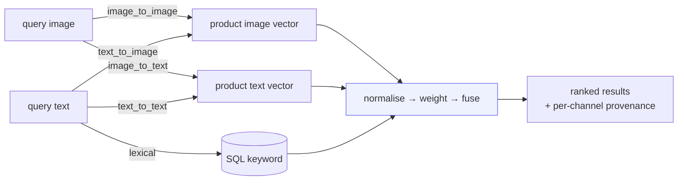

**[measured]** The cross-modal channels are not decoration. For image queries,
`image_to_text` (nDCG@10 **0.818**) slightly *beat* `image_to_image` (**0.796**) —
product text names the article type explicitly. Hence `CROSS_MODAL_WEIGHT`
defaults to 0.3, not 0.

### Scoring

```
image_similarity = (1−c)·s(img_q, img_p) + c·s(img_q, txt_p)
text_similarity  = (1−c)·s(txt_q, txt_p) + c·s(txt_q, img_p)

final = IMAGE_WEIGHT·norm(image_similarity)
      + TEXT_WEIGHT·norm(text_similarity)
      + LEXICAL_WEIGHT·norm(lexical)
```

where `c = CROSS_MODAL_WEIGHT` and weights are renormalised to sum to 1 — so a
text-only query is never penalised for having fewer active channels.

`norm()` is the point. Given image↔image ≈ 0.73 and image↔text ≈ 0.31, summing raw
scores would let one channel dominate irrespective of its weight.

Alternatives, both selectable per request: **`rrf`** (combines ranks, scale-free)
and **`embedding_fusion`** (`α·image + (1−α)·text` into one query vector — the
naive approach, benchmarked and beaten; see
[experiments](#experiments-what-measurement-changed)).

## Architecture

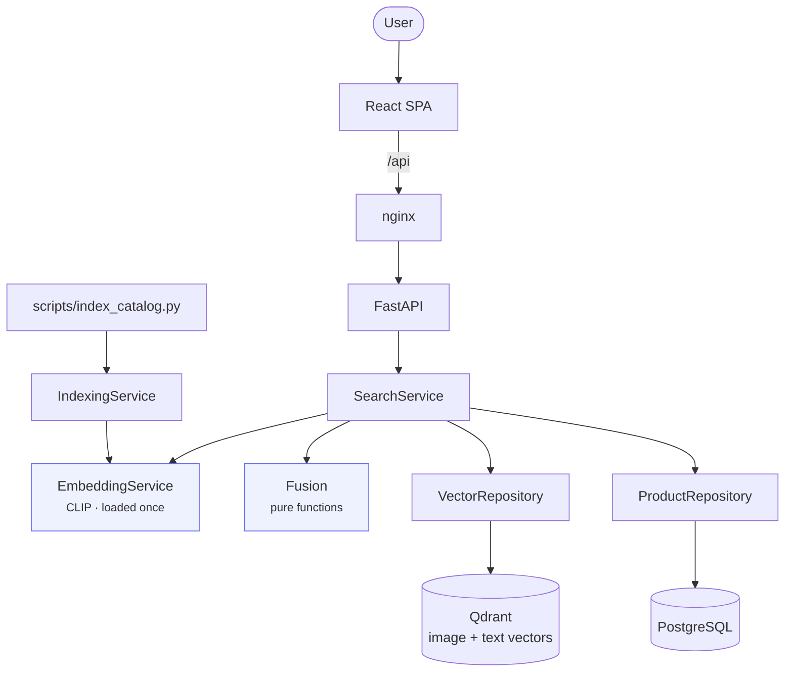

Strict layering: routes parse and delegate, services orchestrate, repositories own
all data access. Services never import `HTTPException` — they raise domain errors
that a single handler set maps to HTTP, which keeps business logic
transport-independent. `services/fusion.py` is deliberately pure, which is why the
ranking arithmetic is unit-testable against hand-computed values.

The CLI, the API and the evaluation harness all drive the *same* service objects,
so there is no parallel implementation that could drift.

**→ [`docs/architecture.md`](docs/architecture.md)** covers the request lifecycle,
ingestion pipeline, error taxonomy, security posture and performance decisions.

## Tech stack

| Layer | Choice | Why |
|---|---|---|
| Embeddings | CLIP ViT-B/32 (`transformers`) | One 512-d space for both modalities *by construction*; ~600 MB; 19–21 products/s on CPU. Swappable to OpenCLIP/SigLIP via one env var. |
| Vector store | Qdrant | Named vectors per point, payload filtering inside the engine, and an embedded mode that needs no server |
| Metadata | PostgreSQL (SQLite locally) | Real full-text search for the lexical channel; SQLite keeps the project runnable with zero infrastructure |
| API | FastAPI + Pydantic v2 | Async, and the OpenAPI document is generated from the same models that validate requests |
| ORM | SQLAlchemy 2 async + Alembic | One code path for both dialects |
| Frontend | React 19 · TypeScript · Vite · Tailwind 4 | — |
| Tests | pytest (444 tests, 90%) | Real DB + real Qdrant; only the encoder is faked |

## Evaluation: measured, not claimed

46 benchmark queries against 6,000 products, `openai/clip-vit-base-patch32`, CPU.

| Mode | Queries | nDCG@10 | MRR | P@10 | R@10 |
|---|---|---|---|---|---|
| Text-only | 16 | 0.677 | 0.891 | 0.637 | 0.233 |
| Image-only | 10 | **0.878** | **1.000** | **0.860** | 0.118 |
| Multimodal | 20 | 0.617 | 0.797 | 0.580 | 0.287 |
| All combined | 46 | 0.694 | 0.874 | 0.661 | 0.231 |

**These rows are not comparable to each other** — each mode is scored on the query
set designed for it. `R@10` is also bounded by `10/|relevant|`, and relevant sets
hold 10–73 products, so R@10 ≈ 0.23 sits near its ceiling. Compare on nDCG@10 and
MRR.

### Does fusion actually help?

The **same** 20 multimodal queries through different channels:

| Channels | nDCG@10 | MRR |
|---|---|---|
| Image only | 0.395 | 0.527 |
| Text only | 0.595 | 0.804 |
| **Both** | **0.617** | 0.797 |

Yes — and per group, at each group's own optimum, fusion beats both single
modalities (contradiction 0.429 vs 0.405/0.056; agreement 0.831 vs 0.786/0.735).

**Relevance is attribute-derived**, so this measures attribute agreement rather
than human preference. Methodology and all eight limitations:
**→ [`docs/evaluation.md`](docs/evaluation.md)**.

## Experiments: what measurement changed

Seven sweeps in
[`evaluation/results/experiments.md`](evaluation/results/experiments.md). The three
that changed the design:

**The optimal image/text weight depends on the query, by 5×.**

| `IMAGE_WEIGHT` | *"this, but in black"* (contradiction) | photo + *"black handbag"* (agreement) |
|---|---|---|
| 0.1 | **0.429** | 0.805 |
| 0.5 | 0.279 | **0.831** |
| 1.0 | 0.056 | 0.735 |

Contradiction queries collapse 7.7× as image weight rises — weighting the image
heavily drags results back toward the attribute the user asked to *change*. No
global constant is right, so the weights are per-request parameters and a UI
slider. The 0.2 default is only the mean-optimum across a 50/50 query mix.

**An unfair comparison produced the wrong answer.** Experiment 4 first compared
`weighted_sum` at its default 50/50 weighting against `embedding_fusion` at a
text-heavy α = 0.3, and "found" that the naive single-vector approach won. That was
an artefact of unequal weighting. Pinning the image share across strategies
reversed it: `weighted_sum` 0.598 vs `embedding_fusion` 0.574. The script now
enforces the matched comparison. (`embedding_fusion` does win on MRR, 0.832 — a
real trade-off, not a one-sided result.)

**Score normalisation matters less than expected.** z-score 0.682, none
0.655–0.677, min-max 0.646. Reported plainly: its main value is making the weights
interpretable, not a quality jump.

## Dataset

[`ashraq/fashion-product-images-small`](https://huggingface.co/datasets/ashraq/fashion-product-images-small)
— 44,072 products with images *and* structured attributes, public, no auth.

**Field provenance, stated plainly:**

| Field | Status |
|---|---|
| category, article type, colour, gender, usage, season, year, name | **Real** — verbatim from the dataset |
| `brand` | **Extracted** from the product name by frequency mining (98.5% coverage, 478 brands) |
| `description` | **Derived** — templated from real attributes; states no new facts |
| `price` | **SYNTHETIC** — the dataset has no price column |

Prices are deterministic hash-derived values inside per-article-type bands. They
exist so price filtering and sorting can be demonstrated and tested for
*correctness*; no evaluation query depends on price, and the UI labels them as
synthetic.

**No dataset images are committed** — the upstream dataset declares no licence, so
`scripts/prepare_sample.py` fetches them on demand. Only a 1,000-row metadata CSV
is in the repo.

**→ [`data/README.md`](data/README.md)** for the brand-mining algorithm, the
stratified sampling rationale, and how to ingest your own catalogue.

## API

Interactive docs at `/docs` once running. 17 endpoints:

| Method | Path | Purpose |
|---|---|---|
| `POST` | `/api/search/text` | Natural-language search |
| `POST` | `/api/search/image` | Visual search (multipart upload) |
| `POST` | `/api/search/multimodal` | Image + text together |
| `POST` | `/api/search/multimodal/json` | Same, with base64 or a catalogue product id |
| `POST` | `/api/search/similar/{id}` | More like this product |
| `GET` | `/api/products` | List with filters, sorting, pagination |
| `GET` | `/api/products/facets` | Filter values with counts |
| `GET`·`POST`·`PUT`·`DELETE` | `/api/products[/{id}]` | CRUD |
| `POST` | `/api/catalog/index` | Index or re-index |
| `GET` | `/api/catalog/stats` | Catalogue and index state |
| `GET` | `/api/health` · `/health/live` · `/health/ready` | Detailed · liveness · readiness |
| `GET` | `/api/media/{path}` | Serve a catalogue image (dev convenience) |

```bash
curl -X POST http://localhost:8000/api/search/text \
  -H 'Content-Type: application/json' \
  -d '{"query":"black leather shoes for the office","top_k":5,
       "filters":{"categories":["Footwear"],"max_price":150}}'
```

```bash
curl -X POST http://localhost:8000/api/search/multimodal \
  -F 'file=@shoe.jpg' \
  -F 'query=the same style but in black' \
  -F 'options={"top_k":10,"fusion":{"image_weight":0.3,"text_weight":0.7}}'
```

Every search response includes the effective weights, a per-channel score
breakdown, and a latency split:

```json
{
  "mode": "multimodal",
  "channels_used": ["image_to_image", "image_to_text", "text_to_text", "text_to_image"],
  "weights": {"image_to_image": 0.14, "image_to_text": 0.06,
              "text_to_text": 0.56, "text_to_image": 0.24},
  "timings": {"embed_ms": 82.0, "retrieve_ms": 11.4, "fuse_ms": 0.8, "total_ms": 100.5},
  "results": [{
    "rank": 1,
    "score": 0.7102,
    "product": {"name": "Red Tape Men Formal Black Formal Shoes", "price": 125.95},
    "breakdown": {
      "image_similarity": 0.7060,
      "text_similarity": 0.5637,
      "channels": [{"channel": "image_to_image", "raw": 0.706,
                    "normalized": 0.83, "weight": 0.14, "rank": 3}]
    }
  }]
}
```

Errors are uniform, and never leak a stack trace:

```json
{ "error": { "code": "invalid_image",
             "message": "The uploaded file is not a recognised image.",
             "details": { "filename": "notes.txt" } } }
```

## Configuration

All settings are environment variables; see [`.env.example`](.env.example), which
documents the measured evidence for each ranking default.

| Variable | Default | Notes |
|---|---|---|
| `DATABASE_URL` | SQLite | `postgresql+asyncpg://…` for PostgreSQL |
| `QDRANT_URL` | *(unset)* | Unset ⇒ embedded Qdrant at `QDRANT_PATH` |
| `MODEL_NAME` | `openai/clip-vit-base-patch32` | Any HF dual encoder |
| `FUSION_STRATEGY` | `weighted_sum` | `weighted_sum` · `rrf` · `embedding_fusion` |
| `SCORE_NORMALIZATION` | `zscore` | **[measured]** 0.682 vs 0.646 min-max |
| `IMAGE_WEIGHT` / `TEXT_WEIGHT` | `0.2` / `0.8` | **[measured]** Only apply when both modalities present |
| `CROSS_MODAL_WEIGHT` | `0.3` | **[measured]** Share given to the other modality's vector |
| `LEXICAL_WEIGHT` | `0.0` | **[measured]** Off; re-measure on PostgreSQL |
| `MAX_UPLOAD_BYTES` | `10485760` | 10 MB |

Embedding dimensionality is deliberately **not** configurable — it is read from the
loaded model, so `MODEL_NAME` cannot desynchronise from the Qdrant collection.

```bash
# after changing MODEL_NAME
python scripts/index_catalog.py --force --recreate
python scripts/verify_embedding_space.py   # confirm the new model's spaces align
```

## Testing

```bash
cd backend
pytest                            # 435 fast tests, ~11 s
RUN_SLOW_TESTS=1 pytest           # + 9 tests that load the real CLIP model
pytest --cov=app --cov-report=term-missing
```

**444 tests, 90% coverage.** The database and vector store are **real** (SQLite on
a temp file, embedded Qdrant on a temp dir); only the encoder is replaced by a
deterministic hash-derived fake. That is a deliberate split: loading CLIP per test
run would be slow *and* would make assertions depend on model behaviour rather than
on this code. A controllable fake tests the retrieval and ranking logic *harder*,
because exact expectations can be constructed.

| Area | Coverage |
|---|---|
| `services/fusion.py` (ranking) | **100%** |
| `schemas/search.py`, `core/text.py` | **100%** |
| `api/v1/routes/*` | **100%** |
| `services/search_service.py` | 92% |
| `services/embedding.py` | 89% |

Ranking arithmetic is asserted against values computed by hand in the test bodies,
not snapshotted. Real-model behaviour — including that the two towers share a space
and that the modality gap exists as documented — is covered by the `slow` suite.

<details>
<summary>Bugs these tests and checks actually caught</summary>

- `func.cast(..., func.INTEGER().type)` was invalid SQLAlchemy and broke
  `/catalog/stats` outright → replaced with a portable `CASE`.
- "More like this" raised for products indexed on text only → now falls back to the
  text vector and reports a warning.
- Two Starlette status constants are deprecated in 1.6 and *raised* under
  `filterwarnings = error`.
- `Path.is_symlink()` after `.resolve()` is always `False` — a dead security check
  that looked meaningful. Removed, with the real containment guarantee documented.
- **Coverage itself was misconfigured**: SQLAlchemy's async bridge runs the DBAPI in
  greenlets, so coverage lost its trace after any `await` touching the database and
  reported genuinely-tested code as untested (`products.py` appeared 83%, actually
  100%). Fixed with `concurrency = ["thread", "greenlet"]` — confirmed by a spy test
  proving the service really is in the request path.
- Generated product descriptions read *"the the fall season"* and *"a Pink
  tshirts"* → fixed with singularisation and pair-noun handling.
</details>

## Project structure

```
multimodal-product-search/
├── backend/
│   ├── app/
│   │   ├── api/v1/routes/     health · search · products · catalog · media
│   │   ├── core/              config · logging · exceptions · text canonicalisation
│   │   ├── models/ schemas/   SQLAlchemy entities · Pydantic contracts
│   │   ├── repositories/      product (SQL + full-text) · vector (Qdrant)
│   │   ├── services/          embedding · fusion · search · indexing · catalog · images
│   │   ├── evaluation/        metrics · ground truth · runner
│   │   └── data/              dataset adapter · brand mining · CSV loading
│   ├── alembic/               migrations (zero-drift verified)
│   └── tests/                 13 files, 444 tests
├── frontend/src/
│   ├── components/            search · results · filters · ui
│   ├── pages/                 Search · ProductDetail · Catalogue
│   ├── hooks/ services/       state + typed API client
│   └── types/                 mirrors the backend schemas
├── scripts/
│   ├── prepare_sample.py      fetch images for the committed catalogue
│   ├── download_dataset.py    build a larger catalogue
│   ├── index_catalog.py       load + embed + index
│   ├── evaluate.py            quality report
│   ├── run_experiments.py     parameter sweeps
│   └── verify_embedding_space.py   is the model's shared space real?
├── data/                      sample CSV (images fetched on demand)
├── evaluation/                benchmark queries + generated reports
├── docs/                      architecture · evaluation · screenshots
└── docker-compose.yml
```

~9,700 lines of Python (app + scripts), ~4,500 lines of tests, ~3,300 lines of
TypeScript.

## Limitations

Honest about what this is not:

1. **Attribute-derived relevance ≠ human preference.** A visually perfect match
   with a different `baseColour` label counts as a miss.
2. **46 queries is small.** One- or two-point nDCG differences are not significant;
   no confidence intervals are reported. Trust only the large effects.
3. **60 × 80 source images** bound visual precision — fine detail is absent from
   the input.
4. **Synthetic prices** (the dataset has none). Filtering is tested for
   correctness, never realism.
5. **Indexing is synchronous.** Deliberate — the caller gets the real outcome
   including per-product failures — but it does not scale past a few thousand
   products without a task queue.
6. **Single-process model.** One CLIP copy per container; scale horizontally.
7. **`docker compose up` was not executed** in the build environment. The stack was
   validated by equivalence, as described [above](#docker).
8. **No authentication.** The catalogue admin endpoints are unprotected — fine for
   a local demo, not for deployment.
9. **English only**, one model, one catalogue. No multilingual or cross-model
   evaluation.

## Future work

In the order I would tackle it:

1. **Task queue for indexing** — `IndexingService` is already the right seam.
2. **Cross-encoder reranker** over the top ~50 candidates, to model query/product
   interaction rather than approximating it with a weighted sum.
3. **Click-through evaluation** to replace the attribute-derived proxy — and to
   train the reranker.
4. **Per-intent weighting.** The experiments show the optimal weight depends on
   whether the text agrees with the image; even a simple modification detector
   should beat any fixed default.
5. **Quantisation + GPU batch inference** for million-product catalogues.
6. **Auth and rate limiting** before anything faces the internet.

## Where this sits

This is **AIML-5** in the
[AI/ML portfolio](https://github.com/pavankumar05-eslavath/aiml-portfolio), alongside four
tabular/panel-data projects. It is the only one here that is a running *system* rather than an
analysis, and the only one where a neural model is load-bearing rather than decorative —
multimodal retrieval requires a shared image-text embedding space, which no gradient-boosting
model provides.

For the portfolio-wide framing, the cross-project bug list and the verified-numbers reference,
see [`PORTFOLIO_GUIDE.md`](../PORTFOLIO_GUIDE.md). For this project's findings, baselines and
caveats in the portfolio's format, see [`INSIGHTS.md`](INSIGHTS.md).

CI runs lint, `mypy --strict`, the 435-test fast suite, migrations and the frontend build on
every push touching this directory
([`aiml5-ci.yml`](../.github/workflows/aiml5-ci.yml)). It deliberately does **not** run
`make all`: that downloads ~260 MB of dataset shards plus the CLIP checkpoint, so the reported
metrics come from a local run instead of being gated on an external host.

## Licence

MIT — see [LICENSE](LICENSE). Covers the source code only: dataset images are not
redistributed, and model weights remain under their own licences.
