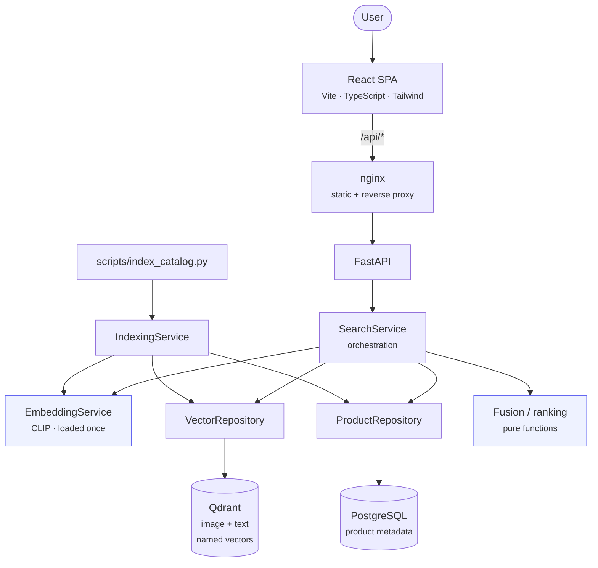
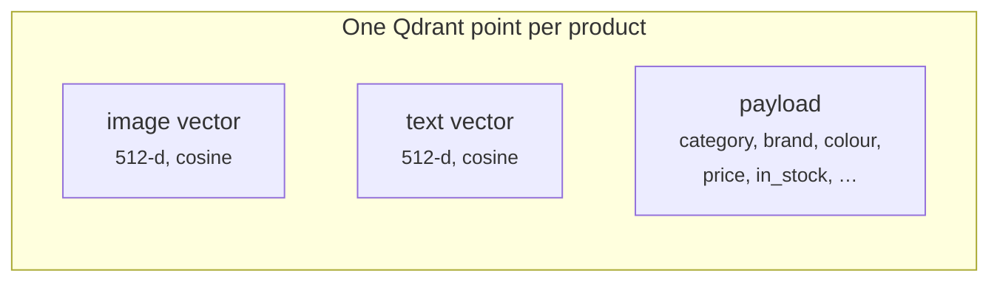
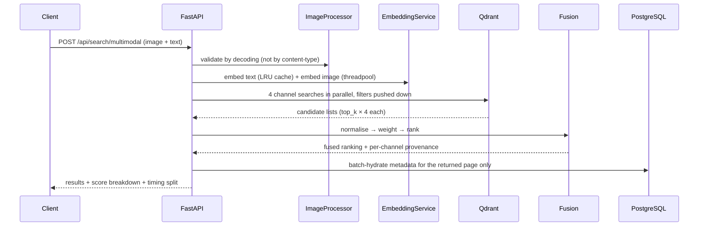
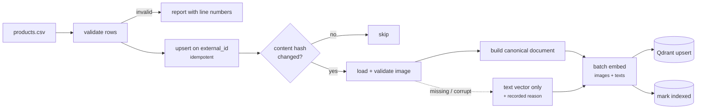
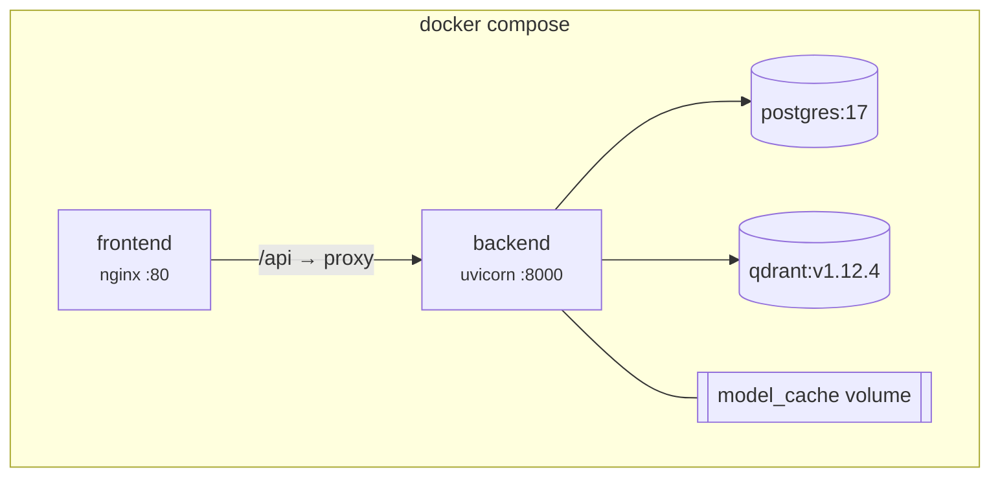

# Architecture

How the system is put together, and why each significant decision was made.
Design choices that were settled by measurement rather than preference are marked
**[measured]** and link to the evidence.

## Contents

- [System overview](#system-overview)
- [The central decision: two named vectors, not one fused vector](#the-central-decision-two-named-vectors-not-one-fused-vector)
- [Retrieval channels](#retrieval-channels)
- [Score fusion](#score-fusion)
- [Request lifecycle](#request-lifecycle)
- [Ingestion pipeline](#ingestion-pipeline)
- [Layering and dependency rules](#layering-and-dependency-rules)
- [Data stores](#data-stores)
- [Model service](#model-service)
- [Performance](#performance)
- [Error handling](#error-handling)
- [Observability](#observability)
- [Security](#security)
- [Deployment](#deployment)
- [What I would do next](#what-i-would-do-next)

## System overview



The CLI and the API share the *same* service objects. `scripts/index_catalog.py`
is a thin wrapper over `IndexingService`, so there is no second ingestion
implementation that could drift from the one the API uses — and the evaluation
harness drives the same `SearchService` the HTTP layer does, which is what makes
its numbers describe the running system.

## The central decision: two named vectors, not one fused vector

The obvious way to build multimodal search is to average the image and text query
embeddings into one vector and do a single nearest-neighbour lookup:

```python
query = alpha * image_embedding + (1 - alpha) * text_embedding   # then search once
```

This project deliberately does **not** default to that, for one reason: a single
fused vector destroys attribution. Once the two queries are averaged, no result
can be traced back to "matched visually" versus "matched the words", so the API
cannot report why anything ranked where it did.

Instead each product is stored as **two named vectors in one Qdrant collection**:



Named vectors — rather than two collections — matter for correctness as well as
convenience: both representations live under one point id, so a product can never
end up with its image in one index and its text missing from another, and one set
of payload filters serves every channel.

Embedding-level fusion is still implemented (`FUSION_STRATEGY=embedding_fusion`)
because it is a legitimate approach worth comparing against. **[measured]** At a
matched image share it ranks slightly *worse* than score-level fusion
(nDCG@10 0.574 vs 0.598) while giving up explainability — though it achieved the
best MRR (0.832), i.e. it more often places a relevant item first while ordering
the remainder less well. See
[`../evaluation/results/experiments.md`](../evaluation/results/experiments.md).

## Retrieval channels

Because both product vectors are queryable, a query produces up to five
independent sources of evidence:

| Channel | Query | Product vector | Interpretation |
|---|---|---|---|
| `text_to_text` | text | text | Same-modality semantic match |
| `text_to_image` | text | image | Cross-modal: does the *photo* look like the words? |
| `image_to_image` | image | image | Visual similarity |
| `image_to_text` | image | text | Cross-modal: does the *description* match the photo? |
| `lexical` | text | — (SQL) | Keyword match, from the metadata store |

**[measured]** The cross-modal channels are not a curiosity — for image queries,
`image_to_text` (nDCG@10 **0.818**) slightly *outperformed* `image_to_image`
(**0.796**). Product text names the article type explicitly, which is exactly what
the ground truth rewards. This is why `CROSS_MODAL_WEIGHT` defaults to a non-zero
0.3 rather than the 0 that intuition suggests.

## Score fusion

### The problem: the channels are not on the same scale

Cosine similarities from different modality pairings occupy genuinely different
ranges. Measured on the sample catalogue with `openai/clip-vit-base-patch32`
(`python scripts/verify_embedding_space.py`):

| Pairing | Mean cosine |
|---|---|
| image ↔ image | **0.7305** |
| text ↔ text | **0.4499** |
| image ↔ text | **0.3124** |

This is CLIP's *modality gap*: matched image/text pairs score ~0.31 while two
unrelated images score ~0.73. Adding these raw makes the configured weights
misleading — at `image_weight = text_weight = 0.5` the same-modality channel
effectively decides the ranking regardless of what the config says.

### Two defences

**1. Per-channel normalisation.** Each channel is rescaled over its own retrieved
candidate pool before weights apply, so a weight of 0.5 really does contribute
half.

**[measured]** The effect on quality is real but modest: z-score 0.682, none
0.655–0.677, min-max 0.646. It is kept on by default because it makes the weights
*mean what they say*, not because it transforms retrieval quality. Being explicit
about the size of that gain matters more than overselling it.

Min-max is *relative*: a pool of uniformly poor matches gets stretched to fill
[0, 1] exactly like a pool of good ones. Normalised scores therefore rank well but
do not indicate absolute quality, so raw cosines are always reported alongside.

**2. Reciprocal rank fusion.** Discards magnitudes entirely and combines ranks,
which is scale-free by construction. Available as `FUSION_STRATEGY=rrf`.

### Two-level weighting

```
                 ┌── same-modality  (1 − CROSS_MODAL_WEIGHT) ──►  text_to_text
   TEXT_WEIGHT ──┤
                 └── cross-modal    (CROSS_MODAL_WEIGHT)     ──►  text_to_image

                 ┌── same-modality  (1 − CROSS_MODAL_WEIGHT) ──►  image_to_image
  IMAGE_WEIGHT ──┤
                 └── cross-modal    (CROSS_MODAL_WEIGHT)     ──►  image_to_text

 LEXICAL_WEIGHT ─────────────────────────────────────────────►  lexical
```

Weights are renormalised to sum to 1, so scores stay on one scale whichever
channels are active. Without this, a text-only query would produce systematically
smaller scores than a multimodal one purely because fewer channels contributed.

A single-modality query gives that modality the *full* weight — a text-only search
is never scaled down by `IMAGE_WEIGHT`.

### Why the weights are request-overridable

**[measured]** This is the most interesting result in the project. Multimodal
queries divide into two kinds with opposite optima:

| Query style | Example | Best `IMAGE_WEIGHT` | nDCG@10 at its optimum |
|---|---|---|---|
| **Contradiction** | photo of a white shoe + *"but in black"* | **0.1** | 0.429 |
| **Agreement** | photo of a black handbag + *"a black handbag"* | **0.5** | 0.831 |

The optima differ five-fold. When the text *contradicts* the image, weighting the
image heavily drags results back toward the very attribute the user asked to
change. At each group's own optimum fusion beats both single modalities, so the
architecture is justified — but **no single global weight is right**, which is why
`IMAGE_WEIGHT`/`TEXT_WEIGHT` are per-request parameters exposed in the API and as
a slider in the UI, and why the environment default (0.2) is only a measured
compromise across a 50/50 query mix.

Every response reports the effective weights and a per-channel breakdown, so the
ranking is auditable rather than a black box.

## Request lifecycle



Four points worth calling out:

* **Filters are pushed into Qdrant**, not applied afterwards, so the HNSW
  traversal itself is constrained. Retrieving a large pool and discarding most of
  it in Python would waste bandwidth *and* recall.
* **Channels are over-fetched** (`top_k × CANDIDATE_MULTIPLIER`). Fusion can only
  reorder what retrieval surfaced, so a pool of exactly `top_k` would make fusion
  unable to rescue an item ranked just outside one channel's cut-off.
* **Channels run concurrently** — four sequential round-trips become one
  wall-clock wait.
* **Metadata is hydrated once**, batched, for the page being returned — not per
  result and not for the whole candidate pool.

## Ingestion pipeline



### Incremental by content hash

Each product carries a SHA-256 fingerprint of the fields an embedding depends on
— **plus the model name**. Switching `MODEL_NAME` therefore invalidates every
vector automatically, instead of leaving a collection quietly mixing embeddings
from two different encoders.

Measured on the 1,000-product sample: first run 46.8 s, second run **0.1 s** with
nothing recomputed. Unchanged products are excluded by the SQL query itself, so
they are never even loaded.

### Partial success is a first-class outcome

A product whose image is missing or corrupt is still indexed on its **text**
vector and stays discoverable, with the reason recorded on the row
(`index_error`) as well as in the logs. Failures are queryable afterwards rather
than lost in a log stream. Conversely, an *embedding* failure is treated as a
batch-level operational fault and raised — a broken model is not per-product bad
data, and marking 64 rows as invalid would disguise the real problem.

### Why indexing is a separate, explicit step

Creating a product does not embed it. A burst of writes would otherwise serialise
behind model inference, and a bulk import should pay the batched-embedding cost
once. Products are returned with `indexed_at: null`, which the UI surfaces as
"pending indexing", and `/api/catalog/stats` exposes the gap.

## Layering and dependency rules

```
api/         HTTP only: parse, validate, delegate, shape the response
  ↓
services/    orchestration and business rules
  ↓
repositories/ all data access; the only place SQL or Qdrant calls appear
  ↓
models/ schemas/  ORM entities and API contracts
core/        config, logging, exceptions, text canonicalisation
```

Two rules are enforced by convention and visible in the code:

* **Services never import `HTTPException`.** They raise domain errors from
  `core/exceptions.py`; one set of handlers maps those to HTTP. This keeps the
  business logic transport-independent and testable without a client.
* **Route handlers contain no orchestration.** Keeping Qdrant consistent with the
  database lives in `CatalogService`, which is why the CLI gets that behaviour for
  free.

`services/fusion.py` is deliberately **pure** — no I/O, no knowledge of Qdrant or
the database. That is why the ranking arithmetic can be unit-tested against
hand-computed expectations, and it is the one module at 100% coverage by design.

## Data stores

### Two profiles, one interface

| | Local (default) | Docker |
|---|---|---|
| Metadata | SQLite + `aiosqlite` | PostgreSQL + `asyncpg` |
| Vectors | Qdrant **embedded** (in-process) | Qdrant **server** |
| Setup | none | `docker compose up` |

The SQLite/embedded profile is not a toy shortcut — it is what lets the project be
cloned, indexed and evaluated with no container runtime at all, and it doubles as
the CPU-only fallback. Dialect-specific behaviour is confined to a handful of
places, and PostgreSQL is the intended deployment target.

Two differences are real and documented rather than hidden:

* **Lexical search.** PostgreSQL uses genuine full-text search
  (`to_tsvector`/`plainto_tsquery` with `ts_rank_cd` and per-field weighting).
  SQLite falls back to term-overlap scoring over a bounded candidate set — weaker,
  and slower, because it scores in Python.
* **Payload indexes are inert in embedded Qdrant.** Filters still work, but
  without index acceleration. Embedded mode warns about this on startup.

### Schema

`products` is a single table. The design points worth noting:

* `id` is a client-generated UUID, because the *same* identifier keys the
  PostgreSQL row and the Qdrant point — it must exist before either write.
* `external_id` is uniquely constrained, which is what makes re-ingesting the same
  source data idempotent instead of duplicating the catalogue.
* `content_hash` drives incremental indexing.
* `indexed_at` / `index_error` / `has_image_vector` / `has_text_vector` make
  indexing state queryable.
* Composite indexes on `(category, price)` and `(brand, price)` support the common
  "filter then order by price" browse path.

Alembic owns schema evolution (`backend/alembic/`); `init_models()` exists for
first-run bootstrap and tests. The initial migration was autogenerated from the
ORM and verified to produce **zero drift** when autogenerate is re-run.

## Model service

`EmbeddingService` loads one encoder per process and exposes
`embed_image` / `embed_text` / `embed_multimodal`.

* **Dimensionality comes from the model**, established by a real forward pass at
  load time — never from configuration. The Qdrant collection is created from that
  value, and a mismatch against an existing collection raises a clear error naming
  the fix rather than failing per-point later.
* **Architecture is validated at load.** A model without `get_image_features` /
  `get_text_features` is rejected outright: it cannot support cross-modal search,
  and failing at startup beats producing embeddings from unrelated spaces.
* **Model swaps are one env var.** `MODEL_NAME` accepts any HF dual encoder —
  CLIP, OpenCLIP, SigLIP (768-d) — followed by
  `python scripts/index_catalog.py --force --recreate`.
* **The shared-space assumption is measured, not assumed.**
  `probe_alignment()` reports cross-modal top-1 accuracy and the per-channel cosine
  distributions; `scripts/verify_embedding_space.py` exits non-zero if the model
  fails, so it can gate CI. On the sample catalogue: top-1 **0.812**, matched pairs
  **0.3124** vs mismatched **0.1794** → PASS.

### Why CLIP ViT-B/32 by default

Trained with a symmetric contrastive objective that places images and text in one
512-d space, so cross-modal cosine similarity is meaningful *by construction*.
It is small (~600 MB), fast enough on CPU (measured **19–21 products/s** during
indexing), and well understood. SigLIP scores better on most benchmarks and is a
one-variable change; the default optimises for a system a reader can actually run.

## Performance

Measured on 8 CPU cores, no GPU:

| Operation | Measurement |
|---|---|
| Model load | ~1.1 s |
| Application startup | ~1.2 s (model loads in background) |
| Indexing throughput | 19–21 products/s |
| Index 1,000 products | 46.8 s |
| Index 6,000 products | 310.9 s |
| Re-index, nothing changed | 0.1 s |
| Text search, end-to-end | ~28 ms (12 ms embed, 8 ms retrieve) |
| Image search | ~74 ms (63 ms embed) |
| Multimodal search | ~100 ms (82 ms embed, 4 channels) |

Query embedding dominates, which is exactly what you would expect from CPU
inference — retrieval and fusion are single-digit milliseconds.

Deliberate optimisations, and the reasoning:

* **Model loaded once at startup, in a worker thread.** The event loop starts
  serving `/health` immediately; inference endpoints return 503 until ready. This
  is also why the container healthcheck probes *liveness*, not readiness — a slow
  first-time model download must not trigger a restart loop.
* **Blocking inference is offloaded** via `anyio.to_thread` behind a
  `CapacityLimiter`, so a burst of requests cannot thrash the CPU.
* **Batched embedding during ingestion** — markedly faster per item than one
  forward pass per product.
* **LRU cache for text-query embeddings**, keyed on model name + canonical
  document.
* **Single-worker containers by design.** Each uvicorn worker would load its own
  ~600 MB copy of the weights; scale by running more containers.
* **Concurrent channel retrieval** and **batched metadata hydration** (above).

**[measured]** Retrieval depth is a genuine trade-off, not a free win: `top_k`
20 → 100 moved nDCG@10 from 0.681 to ~0.698 while median latency went 45.6 →
65.4 ms.

## Error handling

Every failure leaves the API in one shape:

```json
{ "error": { "code": "invalid_image", "message": "…", "details": { } } }
```

Stack traces are never returned — they leak paths and library versions while
telling the caller nothing actionable. Unexpected errors are logged with a
traceback server-side and reported with the request id for correlation.

| Situation | Response |
|---|---|
| Corrupt / non-image upload | 422 `invalid_image` |
| Oversized upload | 413 `image_too_large` |
| Empty query (no text, no image) | 422 `empty_query` |
| Unknown product | 404 `not_found` |
| Duplicate `external_id` | 409 `duplicate_product` |
| Model still loading | 503 `model_not_ready` |
| Qdrant unreachable | 503 `vector_store_unavailable` |
| Database unreachable | 503 `database_unavailable` |

Degradation is graceful and specific:

* One retrieval channel failing → the others still answer; only *all* channels
  failing is an error.
* The lexical channel erroring → semantic search continues without it.
* A product with no indexed image → "more like this" falls back to its text
  vector and says so in `warnings`.
* Qdrant down → `/api/catalog/stats` still returns, reporting `vector_points: -1`.
* Deleting a product when Qdrant is unreachable is **refused** (503) rather than
  leaving an orphaned vector that outlives its metadata.

Startup is tolerant: if Qdrant or the model is unavailable the app still boots and
reports the problem through `/health`. A container that starts and explains what
is broken is more useful than one that refuses to start.

## Observability

Structured logging on the standard library — JSON in containers, aligned
human-readable lines locally. Every request carries an `X-Request-ID` (accepted
from the caller or generated) which appears in every log line for that request,
plus `X-Process-Time-Ms`.

Search logs the mode, strategy, channels, candidate count, filter usage and a
latency split (`embed_ms`, `retrieve_ms`, `total_ms`). The same split is returned
in the response body and rendered in the UI, so the pipeline is inspectable
without server access.

Health is split three ways because the questions differ:

| Endpoint | Question | Used by |
|---|---|---|
| `/api/health/live` | Is the process up? | container healthcheck |
| `/api/health/ready` | Can it serve *search*? | rolling deploys |
| `/api/health` | What exactly is wrong? | humans, dashboards |

An empty collection reports **degraded**, not healthy: search cannot return
anything. 503 is reserved for a dependency being unreachable.

## Security

* **Uploads are validated by decoding**, not by trusting `Content-Type` or the
  file extension. Size is checked on byte length *before* decoding; `verify()`
  rejects truncated files; Pillow's decompression-bomb guard is promoted from a
  warning to a hard rejection.
* **Uploads are never persisted** — they exist in memory for the request only.
* **Path traversal is blocked** by resolving the path and requiring containment
  within `IMAGE_ROOT`. Because resolution follows symlinks, that single check also
  covers links pointing outside the root. A suffix allow-list means non-image
  files inside the root are unreadable too.
* **Containers run unprivileged** (uid 1001) with the data volume mounted
  read-only.
* **No secrets in the repository.** `.env` is git-ignored; the compose file reads
  credentials from the environment; Alembic takes its URL from application
  settings rather than from `alembic.ini`.
* **Strict request validation** — `extra="forbid"` on filters and fusion
  overrides, so a typo like `categorie` fails loudly instead of being silently
  ignored.

## Deployment



Three details that were arrived at by observing failures rather than by guessing:

1. **The Qdrant image ships neither `curl` nor `wget`.** The usual
   `curl -f .../healthz` healthcheck fails forever and the service is never
   reported healthy. It does have `bash`, so the check uses `/dev/tcp`.
2. **nginx resolves a literal `upstream` host once, at startup, and refuses to
   start if it cannot.** That means nginx exits whenever it wins the startup race,
   and a recreated backend keeps receiving traffic at its old IP. Resolution is
   therefore deferred to request time via a variable in `proxy_pass`; nginx now
   starts regardless and returns 502 until the API is up.
3. **The resolver address cannot be hardcoded.** Docker's embedded DNS is on
   `127.0.0.11`, Podman's is on the network gateway, Kubernetes uses cluster DNS.
   Hardcoding produced `recv() failed (111: Connection refused) while resolving`.
   The config is a template and takes the address from the container's own
   `/etc/resolv.conf`.

A fourth, in the same spirit: nginx `add_header` does **not** inherit — one
`add_header` in a `location` discards every server-level header. The security
headers were silently absent until they were moved into a snippet included by
each location.

Model weights live on a named volume, so the ~600 MB download happens once rather
than on every container start.

## What I would do next

Honest gaps, roughly in order of what I would tackle first:

1. **Move indexing to a task queue.** It currently runs synchronously in the
   request. That is a deliberate trade — the caller learns the real outcome
   including per-product failures, rather than a job id to poll — but it does not
   scale past a few thousand products. The `IndexingService` boundary is already
   the right seam for a worker.
2. **A learned reranker.** Score fusion with tuned weights is a strong baseline,
   but a cross-encoder over the top ~50 candidates would model
   query/product interaction rather than approximating it with a weighted sum.
3. **Click-through evaluation.** Attribute-derived relevance measures attribute
   agreement, not preference. Real interaction data would replace the proxy and
   could train the reranker.
4. **Per-intent weighting.** The experiments show the optimal image/text weight
   depends on whether the text agrees with the image. Classifying that intent —
   even a simple negation/modification detector — would beat any fixed default.
5. **Quantisation and larger-scale indexing.** Scalar or product quantisation in
   Qdrant, plus GPU batch inference, for catalogues in the millions.
6. **Image storage.** The `/api/media` endpoint is a development convenience;
   production images belong on a CDN, which `image_url` already supports by
   leaving absolute URLs untouched.
